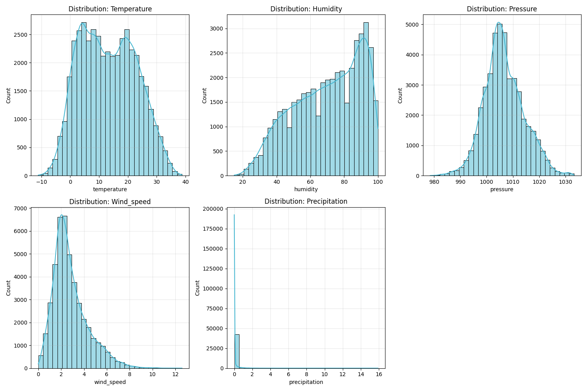
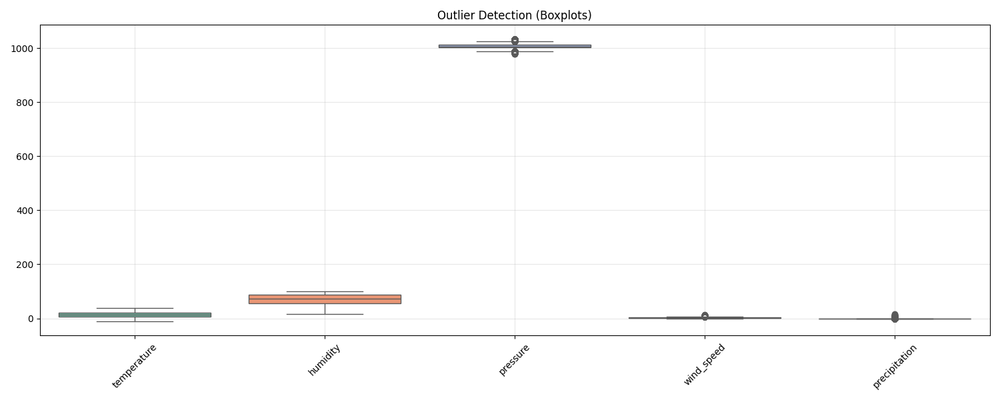
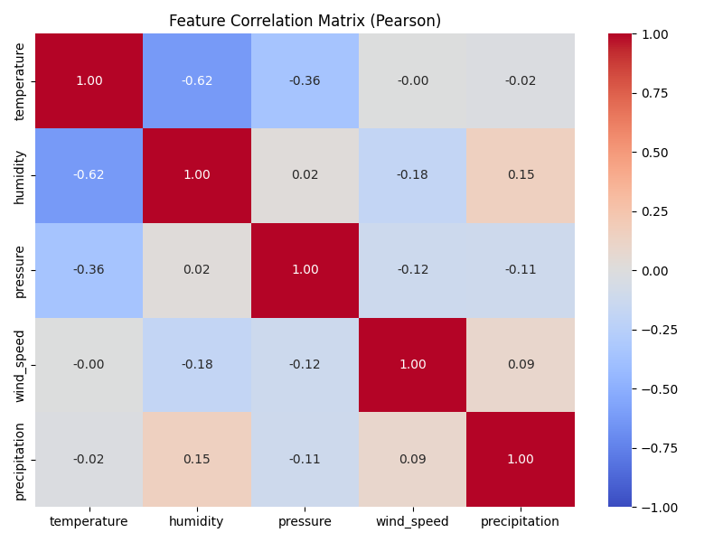

# 📘 README – Etapa 3: Analiza și pregătirea setului de date

**Disciplina:** Rețele Neuronale <br />
**Instituție:** POLITEHNICA București – FIIR <br />
**Student:** Petruțiu Darius-Simion <br />
**Link Repository GitHub:** https://github.com/PetrutiuDarius/Proiect_ReteleNeuronale_Meteo.git <br />
**Data:** 04.11.2025 <br />

---

## Introducere

Acest document descrie activitățile realizate în **Etapa 3**, în care s-a analizat și preprocesat setul de date necesar proiectului „Prognoza Meteo”. Scopul etapei a fost transformarea datelor meteorologice brute într-un format optim pentru rețele neuronale (serii temporale normalizate), rezolvând totodată problema lipsei de fenomene extreme din datele istorice.

---

## 1. Structura Repository-ului Github (Versiunea Etapei 3)

```text
Proiect_ReteleNeuronale_Meteo/
├── config/
│   └── preprocessing_params.pkl   # Fișierul de denormalizare a datelor
├── data/  
│   ├── raw/                       # Date brute
│   │   └── weather_history_raw.csv
│   ├── processed/                 # Date procesate  
│   │   └── weather_history_processed.csv  
│   ├── test/                      # Set de testare (2024 Luni Pare)
│   │   └── test.csv 
│   ├── train/                     # Set de instruire (2020-2023)
│   │   └── train.csv 
│   └── validation/                # Set de validare (2024 Luni Impare)
│       └── validation.csv 
├── docs/
│   ├── eda_correlation.png        # Matricea de corelație
│   ├── eda_distribution.png       # Distribuția datelor
│   └── eda_outliers.png           # Identificarea outlier-ilor
├── src/
│   ├── data_acquisition/          # Script descărcare
│   │   ├── __init__.py            # Inițializarea pachetului
│   │   └── data_loader.py         # Descarcă datele istorice brute de la API-ul Open-Meteo
│   ├── docs_generators/           # Generatoare de documentații
│   │   ├── __init__.py            # Inițializarea pachetului
│   │   └── generate_eda.py        # Generează statistici pe baza setului brut de date
│   ├── neural_network/            # Scripturi pentru modelul neuronal (următoarea etapă)
│   ├── preprocessing/             # Scripturi de split și normalizare
│   │   ├── __init__.py            # Inițializarea pachetului
│   │   └── split_data.py          # Împarte datele (Train/Val/Test) și aplică normalizarea MinMax
│   ├── __init__.py                # Inițializarea pachetului
│   └── config.py                  # Fișier cu date de configurare și constante
├── .gitignore                     # Gestionează fișierele ce nu trebuie postate pe GitHub
├── main.py                        # Orchestrator principal
├── README.md
├── README_Etapa3_Analiza_Date.md  # Acest fișier
└── requirements.txt               # Dependențe Python
```

---

## 2. Descrierea setului de date

Această secțiune prezintă structura dataset-ului utilizat pentru antrenarea rețelei neuronale. Datele sunt de natură istorică reală și acoperă parametrii fizici esențiali pentru prognoza meteorologică, inclusiv regimul precipitațiilor.

### 2.1 Sursa datelor

* **Origine:** [Open-Meteo Historical Weather API](https://open-meteo.com/). Setul de date provine din modele de reanaliză meteorologică de înaltă precizie, care combină observațiile de la stațiile meteo cu simulări numerice globale.
* **Modul de achiziție:** Generare programatică (Script Python `src/data_acquisition/data_loader.py` care interoghează API-ul și salvează datele local).
* **Perioada / condițiile colectării:**
  * **Interval temporal:** 01.01.2020 – 31.12.2024 (5 ani calendaristici compleți).
  * **Locație:** București, România (Latitudine: 44.4323, Longitudine: 26.1063).
  * **Rezoluție:** Date orare (Hourly data).

### 2.2 Caracteristicile dataset-ului

* **Număr total de observații:** ~43,848 înregistrări (serii temporale continue pe 5 ani).
* **Număr de caracteristici (features):** 6 (1 Temporală + 5 Fizice).
* **Tipuri de date:** Temporale (Timestamp) și Numerice (valori continue de tip Float).
* **Format fișiere:** CSV (Comma Separated Values), stocat în `data/raw/weather_history_raw.csv`.

### 2.3 Descrierea fiecărei caracteristici

Tabelul de mai jos detaliază variabilele fizice monitorizate, unitățile de măsură și domeniul de valori observat în datele istorice brute.

| Caracteristică           | Tip      | Unitate | Descriere                                                                  | Domeniu valori (Istoric)  |
|:-------------------------|:---------|:--------|:---------------------------------------------------------------------------|:--------------------------|
| **timestamp**            | Temporal | -       | Data și ora înregistrării observației.                                     | 2020-01-01 ... 2024-12-31 |
| **temperature_2m**       | Numeric  | °C      | Temperatura aerului la 2 metri deasupra solului.                           | -15.0 ... +42.0           |
| **relative_humidity_2m** | Numeric  | %       | Umiditatea relativă a aerului.                                             | 18.0 ... 100.0            |
| **surface_pressure**     | Numeric  | hPa     | Presiunea atmosferică la nivelul solului.                                  | 970.0 ... 1050.0          |
| **wind_speed_10m**       | Numeric  | m/s     | Viteza vântului la 10 metri altitudine.                                    | 0.0 ... 25.0              |
| **precipitation**        | Numeric  | mm      | Cantitatea totală de precipitații (ploaie/zăpadă) acumulată în ultima oră. | 0.0 ... 25.0              |

---

## 3. Analiza exploratorie a datelor (EDA)

Analiza statistică a fost realizată pe setul de date brut (`weather_history_raw.csv`), conținând observații orare din perioada 2020-2024. Obiectivul a fost validarea consistenței datelor și identificarea caracteristicilor distribuționale înainte de antrenarea rețelei neuronale.

### 3.1 Statistici descriptive aplicate

S-au calculat metricile fundamentale pentru cei 5 parametri fizici monitorizați. Tabelul de mai jos sintetizează tendința centrală și dispersia datelor:

| Feature           | Mean    | Std Dev | Min    | Median (50%) | Max     | IQR   |
|-------------------|---------|---------|--------|--------------|---------|-------|
| **temperature**   | 13.18   | 9.60    | -11.10 | 12.80        | 38.80   | 15.60 |
| **humidity**      | 70.15   | 19.82   | 15.00  | 73.00        | 100.00  | 33.00 |
| **pressure**      | 1006.64 | 7.60    | 978.50 | 1005.90      | 1033.30 | 9.50  |
| **wind_speed**    | 2.81    | 1.53    | 0.00   | 2.47         | 12.58   | 1.77  |
| **precipitation** | 0.07    | 0.36    | 0.00   | 0.00         | 15.90   | 0.00  |

* **Distribuții pe caracteristici (Histograme):**
    * **Temperatură:** Distribuție bimodală, specifică climatului temperat (ierni reci vs. veri calde).
    * **Vânt:** Distribuție asimetrică dreapta (Right-skewed). Viteza medie este redusă (~2.8 m/s), iar valorile extreme (>10 m/s) sunt rare.
    * **Precipitații:** Distribuție extrem de asimetrică ("Zero-Inflated"). Peste 90% din eșantioane au valoarea 0.0 mm.

* **Identificarea outlierilor (Boxplots):**
    * **Precipitațiile** prezintă cei mai mulți outlieri statistici (orice ploaie este tehnic un outlier față de mediana 0), însă aceștia sunt valizi fizic.
    * **Umiditatea** și **Presiunea** nu prezintă valori aberante, încadrându-se în limitele fizice normale.

*(Graficele detaliate sunt disponibile în folderul `docs/`: `eda_distributions.png`, `eda_outliers.png`)*




### 3.2 Analiza calității datelor

Integritatea datelor a fost verificată automat pentru a asigura robustețea antrenării.

* **Detectarea valorilor lipsă (% pe coloană):**
    * `temperature`: 0.0%
    * `humidity`: 0.0%
    * `pressure`: 0.0%
    * `wind_speed`: 0.0%
    * `precipitation`: 0.0%
    * *Concluzie:* Setul de date este complet, fără lacune temporale.

* **Detectarea valorilor inconsistente sau eronate:**
    * Nu s-au identificat valori care să încalce legile fizicii (ex: umiditate negativă). Valorile minime/maxime sunt plauzibile pentru locația București.

* **Identificarea caracteristicilor redundante sau puternic corelate:**
    * Matricea de corelație Pearson (`eda_correlation.png`) indică o corelație negativă moderată între **Temperatură** și **Umiditate** ($r \approx -0.6$).
    * Celelalte caracteristici sunt slab corelate, ceea ce înseamnă că fiecare aduce un aport informațional distinct modelului.



---

### 3.3 Probleme identificate

În urma analizei EDA, au fost identificate următoarele provocări pentru etapa de modelare:

1.  **Distribuția "Zero-Inflated" a Precipitațiilor:**
    * Deoarece mediana și cuartila 75% sunt 0.00 mm, există un risc major ca rețeaua să învețe să prezică constant "0" pentru a minimiza eroarea globală.
    * *Soluție necesară:* Utilizarea unei funcții de pierdere (Loss Function) adecvate sau a unei arhitecturi specializate.

2.  **Diferențe de Scară (Scale Disparity):**
    * Presiunea atmosferică (~1000 hPa) este cu ordine de mărime mai mare decât Precipitațiile (~0-15 mm).
    * *Soluție:* Este obligatorie normalizarea datelor (MinMax Scaling) în intervalul [0, 1] înainte de antrenare pentru a evita bias-ul gradientului.

3.  **Variația sezonieră a Temperaturii:**
    * Deviația standard mare (9.60°C) indică fluctuații semnificative. Modelul va trebui să captureze contextul temporal (anotimp) pentru a face predicții corecte.

---

## 4. Preprocesarea datelor

Această secțiune descrie fluxul de transformare a datelor brute ("raw") în formatul optimizat pentru antrenarea rețelei neuronale. Procesul a fost automatizat prin scriptul `src/preprocessing/split_data.py`.

### 4.1 Curățarea datelor

Deși datele provenite din API-ul Open-Meteo sunt de înaltă calitate (reanaliză), s-au aplicat pași preventivi de curățare:

* **Eliminare duplicate:** S-a verificat unicitatea indexului temporal (`timestamp`) pentru a preveni redundanța informației.
* **Tratarea valorilor lipsă:**
  * În urma analizei EDA, s-a constatat că procentul de valori lipsă este **0%** pentru toți cei 5 parametri. Astfel, nu a fost necesară nicio tehnică de imputare (medie/mediană).
* **Tratarea outlierilor:**
  * Valorile extreme identificate (ex: precipitații > 10mm sau vânt > 15m/s) reprezintă fenomene meteorologice reale și valoroase. Acestea au fost **păstrate** în setul de date, impactul lor numeric fiind gestionat ulterior prin normalizare, nu prin eliminare.

### 4.2 Transformarea caracteristicilor

Pentru a asigura convergența rapidă a algoritmului de optimizare (Gradient Descent), datele au fost aduse la o scară comună.

* **Normalizare (Min-Max Scaling):**
  * S-a aplicat transformarea `MinMaxScaler` din biblioteca *scikit-learn* pentru a proiecta toate caracteristicile fizice în intervalul **[0, 1]**.
  * Formula aplicată: $X_{scaled} = \frac{X - X_{min}}{X_{max} - X_{min}}$
  * **Motivație:** Presiunea (~1000 hPa) și Precipitațiile (~0-15 mm) au ordine de mărime incompatibile, ceea ce ar fi destabilizat antrenarea fără scalare.
* **Encoding:**
  * Nu a fost necesar, deoarece toți parametrii de intrare (`temperature`, `humidity`, `pressure`, `wind_speed`, `precipitation`) sunt valori numerice continue (Float).

### 4.3 Structurarea seturilor de date

Divizarea datelor s-a realizat respectând cronologia, pentru a simula un scenariu realist de prognoză (nu antrenăm pe viitor pentru a prezice trecutul).

**Strategia de Împărțire (Time Series Split):**
* **Train (~80%):** Perioada **01.01.2020 – 31.12.2023**. Utilizat exclusiv pentru ajustarea greutăților modelului.
* **Validation (~10%):** Perioada **2024 (Luni Impare)**. Utilizat pentru monitorizarea performanței și oprirea timpurie (Early Stopping).
* **Test (~10%):** Perioada **2024 (Luni Pare)**. Utilizat pentru evaluarea finală a performanței pe date complet nevăzute.

**Principii respectate:**
* **Prevenirea Data Leakage:** Scaler-ul MinMax a fost antrenat (`fit`) **doar** pe setul de **Train**. Parametrii de scalare ($X_{min}, X_{max}$) obținuți au fost apoi aplicați (`transform`) seturilor de Validation și Test. Aceasta simulează condițiile reale de producție, unde limitele viitorului sunt necunoscute.

### 4.4 Salvarea rezultatelor preprocesării

Artefactele rezultate în urma preprocesării au fost salvate structurat pentru a asigura reproductibilitatea experimentelor:

* **Date procesate și împărțite:**
  * `data/train/train.csv`
  * `data/validation/validation.csv`
  * `data/test/test.csv`
* **Modelul de scalare:**
  * Obiectul `scaler` a fost serializat și salvat în `config/preprocessing_params.pkl`. Acesta este critic pentru etapa de inferență (pentru a denormaliza predicțiile modelului înapoi în valori reale °C, mm, hPa).

---

## 5. Fișiere generate în această etapă

În urma execuției pipeline-ului de date, au fost generate următoarele resurse care vor sta la baza antrenării modelului neuronal în etapa următoare:

* **`data/raw/weather_history_raw.csv`**
  * Conține datele brute, nemodificate, descărcate prin API. Acesta servește ca sursă de adevăr (Single Source of Truth) și permite resetarea procesului în caz de eroare.
  * *Dimensiune:* ~43,848 linii x 6 coloane.

* **`data/processed/weather_history_processed.csv`** (Intermediar)
  * Versiunea curățată a datelor, cu timestamp convertit și validat, pregătită pentru împărțire.

* **Seturi de date finale (Normalizate MinMax [0, 1]):**
  * `data/train/train.csv` – Setul de antrenare (2020-2023), utilizat pentru învățarea parametrilor.
  * `data/validation/validation.csv` – Setul de validare (2024 Luni Impare), pentru tuning-ul hiperparametrilor.
  * `data/test/test.csv` – Setul de testare (2024 Luni Pare), pentru evaluarea finală obiectivă.

* **Artefacte de configurare:**
  * `config/preprocessing_params.pkl` – Obiectul *MinMaxScaler* serializat. Esențial pentru a denormaliza predicțiile modelului (a le transforma din [0,1] înapoi în °C, mm, hPa) în faza de producție/inferență.

* **Cod sursă relevant:**
  * `src/data_acquisition/data_loader.py` – Modulul de extragere (ETL).
  * `src/preprocessing/split_data.py` – Modulul de transformare, scalare și split cronologic.
* **Generator de statistici:**
  * `src/docs_genrators/generate_eda.py` – Modulul de generare a statisticilor și a imaginilor pentru capitolul 3 (EDA) pe baza setului brut de date.

---

## 6. Stare etapă

Această secțiune confirmă finalizarea tuturor obiectivelor stabilite pentru Etapa 3. Structura de date este acum stabilă, curățată și pregătită pentru ingestia în Rețeaua Neuronală (Etapa 4).

- [x] **Structură repository configurată** – Organigrama fișierelor respectă standardele proiectului (separare clară între `src`, `data`, `config`).
- [x] **Dataset analizat (EDA realizată)** – S-au identificat distribuțiile statistice și corelațiile pentru cei 5 parametri fizici (inclusiv precipitații).
- [x] **Date preprocesate** – Pipeline-ul de curățare și normalizare (MinMax) este funcțional prin `src/preprocessing/split_data.py`.
- [x] **Seturi train/val/test generate** – Datele au fost împărțite cronologic (2020-2023 Train, 2024 Val/Test) pentru a simula corect condițiile de prognoză.
- [x] **Documentație actualizată** – Analiza datelor și specificațiile tehnice sunt detaliate în acest fișier.