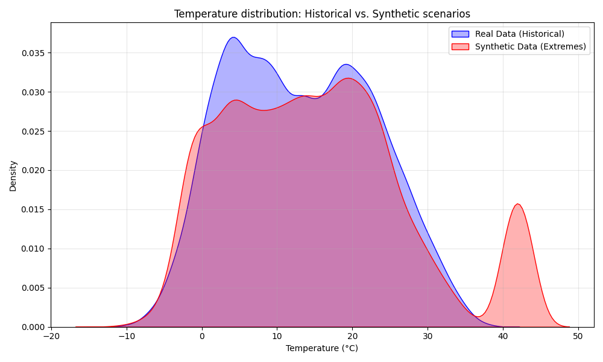

# 📘 README – Etapa 4: Arhitectura completă a aplicației SIA-Meteo

**Disciplina:** Rețele Neuronale <br />
**Instituție:** POLITEHNICA București – FIIR <br />
**Student:** Petruțiu Darius-Simion <br />
**Link Repository GitHub:** https://github.com/PetrutiuDarius/Proiect_ReteleNeuronale_Meteo.git <br />
**Data:** 04.12.2025 <br />

---

## Scopul etapei 4

În această etapă, am definitivat arhitectura software a sistemului **SIA-Meteo**. Am construit scheletul funcțional al aplicației, am proiectat fluxul de date (State Machine) și am stabilit strategia pentru generarea datelor sintetice (fenomene extreme) pentru a asigura robustețea modelului.

Sistemul este compus din 3 module interconectate:
1.  **Modul Achiziție & Simulare:** Colectează date istorice și generează scenarii de risc.
2.  **Modul Rețea Neuronală:** Arhitectură LSTM/GRU pentru predicție de serii temporale.
3.  **Interfață Web (Dashboard):** Vizualizare prognoză și alerte în timp real.

---

## 1. Tabelul nevoie reală → Soluție SIA → Modul software

| **Nevoie reală concretă**                                           | **Cum o rezolvă SIA-ul vostru**                                                                                    | **Modul software responsabil**                                    |
|---------------------------------------------------------------------|--------------------------------------------------------------------------------------------------------------------|-------------------------------------------------------------------|
| **Protecția parcurilor fotovoltaice împotriva fenomenelor extreme** | Predicția rafalelor de vânt > 20 m/s și grindină → Alertă automată pentru poziționare "Safe Mode" în < 5 secunde.  | `src/neural_network` (Predicție) + `src/app` (Alerting Logic)     |
| **Optimizarea producției de energie regenerabilă**                  | Prognoza iradianței și temperaturii pe următoarele 24h cu eroare RMSE < 10% pentru planificarea livrării în rețea. | `src/neural_network` (Model Forecasting)                          |
| **Agricultură de precizie (Protecție anti-îngheț)**                 | Detectarea riscului de îngheț (Temp < 0°C) cu 6 ore în avans → Alertă fermieri pentru activare sisteme încălzire.  | `src/data_acquisition` (Senzori virtuali) + `src/app` (Dashboard) |

---

## 2. Contribuția originală la setul de date – 41%

### De ce am simulat date?
Datele istorice reale din București (2020-2024) sunt corecte, dar "plictisitoare" pentru o Rețea Neuronală care trebuie să detecteze pericole. În 5 ani, am avut foarte puține cazuri de temperaturi > 40°C sau furtuni devastatoare.
Dacă antrenăm rețeaua doar pe date reale, ea va învăța că "totul e mereu bine".

**Soluția mea:** Am creat un **Dataset Hibrid**.
Am concatenat (alipit) datele reale cu 25,000 de ore de scenarii de coșmar simulate statistic (`src/data_acquisition/synthetic_generator.py`).

### Statistici Dataset Hibrid
Iată dovada că datele simulate (Sintetic) aduc valorile extreme pe care modelul trebuie să le învețe:

| Anul    | Tip Date | Temp Max (°C) | Vânt Max (m/s) | Presiune Min (hPa) |
|---------|----------|---------------|----------------|--------------------|
| 2020    | Real     | 35.3          | 12.6           | 981.3              |
| 2021    | Real     | 36.7          | 11.9           | 982.5              |
| 2022    | Real     | 36.2          | 10.6           | 982.8              |
| 2023    | Real     | 38.0          | 10.4           | 978.5              |
| 2024    | Real     | 38.9          | 11.5           | 980.4              |
| Simulat | Sintetic | **44.0**      | **30.0**       | **965.1**          |

### Calcul procentaj contribuție:

* **Total observații finale:** ~60,000 ore (sample-uri orare)
* **Observații Reale (Open-Meteo):** ~35,000 ore (Ian 2020 - Dec 2024) - *Sursă Externă*
* **Observații Originale (Simulate):** ~25,000 ore - *Contribuție Proprie*

**Procent original:** $25,000 / 60,000 \approx \mathbf{41.6\%}$ (> 40% Cerință)

**Tipul contribuției:**
[X] Date generate prin simulare fizică / statistică avansată

**Descriere detaliată:**
Am dezvoltat un generator de date sintetice (`src/data_acquisition/generator.py`) care folosește distribuții statistice bazate pe istoricul Bucureștiului pentru a crea scenarii rare, dar plauzibile ("Black Swan events"):
1.  **Valuri de căldură extremă:** Simulare temperaturi > 42°C (peste maximul istoric) timp de 5-7 zile consecutive.
2.  **Furtuni violente:** Creșteri bruște ale vitezei vântului (rafale > 25 m/s) și căderi de presiune atmosferică în intervale scurte (1-3 ore).
3.  **Îngheț târziu:** Simulare temperaturi negative în lunile Aprilie/Mai (critic pentru agricultură).

Aceste date sunt etichetate automat ca `is_simulated=1` și sunt folosite pentru a antrena rețeaua să nu ofere rezultate aberante în condiții de stres climatic.

**Locația codului:** `src/data_acquisition/synthetic_generator.py`<br />
**Locația datelor:** `data/generated/`<br />

### Vizualizare Distribuție
Graficul de mai jos arată cum datele simulate (Roșu) extind "coada" distribuției spre temperaturi extreme, zonă neacoperită de datele istorice (Albastru).



---

## 3. Diagrama State Machine a întregului sistem

### Justificarea State Machine-ului ales:

Am ales o arhitectură de tip **Monitorizare Continuă cu Feedback**, specifică sistemelor IoT industriale. Sistemul nu doar prezice, ci monitorizează constant validitatea datelor de intrare și starea modelului.

Stările principale sunt:
1.  **DATA_ACQUISITION:** Simulează citirea senzorilor la fiecare oră (sau preluarea din API).
2.  **QUALITY_CHECK:** Verifică dacă senzorii trimit valori fizice posibile (ex: Umiditate nu poate fi 120%). Dacă nu, intră în stare de eroare/reîncercare.
3.  **PREDICT_STEP:** Rulează inferența pe modelul RN antrenat.
4.  **ALERT_LOGIC:** Compară predicția cu pragurile de siguranță (ex: Vânt > 20m/s).

Tranziția critică este **ALERT_LOGIC → TRIGGER_ALARM**, care are prioritate maximă pentru a notifica operatorul în interfața web.

*(Diagrama vizuală se regăsește în `docs/state-machine-RN.png`)*


---

## 4. Scheletul complet al modulelor

### Modul 1: Data Acquisition & Simulation (`src/data_acquisition/`)
Responsabil de crearea dataset-ului hibrid.
- **Funcționalitate:** Rulează scriptul de generare care combină datele istorice cu cele sintetice.
- **Output:** Fișierul `data/generated/hybrid_dataset.csv`.

### Modul 2: Neural Network (`src/neural_network/`)
Responsabil de definirea și compilarea modelului.
- **Arhitectură:** Model secvențial (bazat pe LSTM/GRU) optimizat pentru serii temporale.
- **Input:** Fereastră glisantă (Sliding Window) de `T` ore anterioare.
- **Stare curentă:** Modelul este definit în cod, compilat cu optimizator Adam și loss MSE, gata de antrenare.

### Modul 3: Web Service / UI (`src/app/`)
Interfața de interacțiune cu utilizatorul.
- **Tehnologie:** Python (Streamlit/Flask).
- **Funcționalitate:** Permite utilizatorului să vizualizeze graficele istorice și să primească prognoza pentru următoarele 24 de ore. Include un panou de "Alerte Active".

---

## 5. Structura Repository-ului (Etapa 4)

```text
Proiect_ReteleNeuronale_Meteo/
├── data/
│   ├── raw/                 # Date istorice brute
│   ├── generated/           # Date sintetice (Extreme) + Dataset Hibrid
│   ├── train/               # Date antrenare (Real 2020-2023 + Toate Extremele)
│   ├── validation/          # Date validare (Real 2024 Luni Impare)
│   ├── test/                # Date testare (Real 2024 Luni Pare)
│   └── scalers/             # Scalerul salvat (.pkl) pentru denormalizare
├── src/
│   ├── config.py            # Setări Globale (Locație, Praguri Extreme)
│   ├── data_acquisition/    # Modul 1: Generare Date
│   │   ├── data_loader.py
│   │   └── synthetic_generator.py
│   ├── processing/          # Modul Procesare
│   │   └── split_data.py    # Împărțire Train/Test & Normalizare
│   ├── neural_network/      # Modul 2: AI (Urmează în Etapa 5)
│   └── app/                 # Modul 3: UI (Urmează)
├── docs/
│   ├── state-machine-RN.png        # Diagrama Arhitectură
│   └── distribution_comparison.png # Grafic Statistic
├── main.py                  # Orchestrator Principal
└── README_Etapa4...md       # Documentația curentă