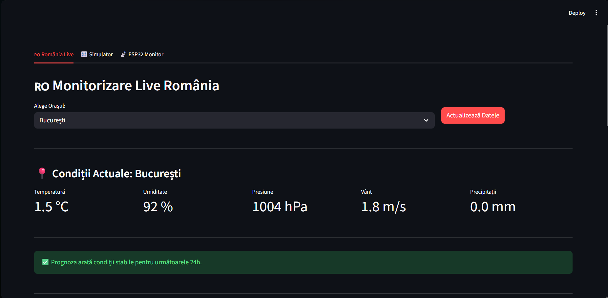
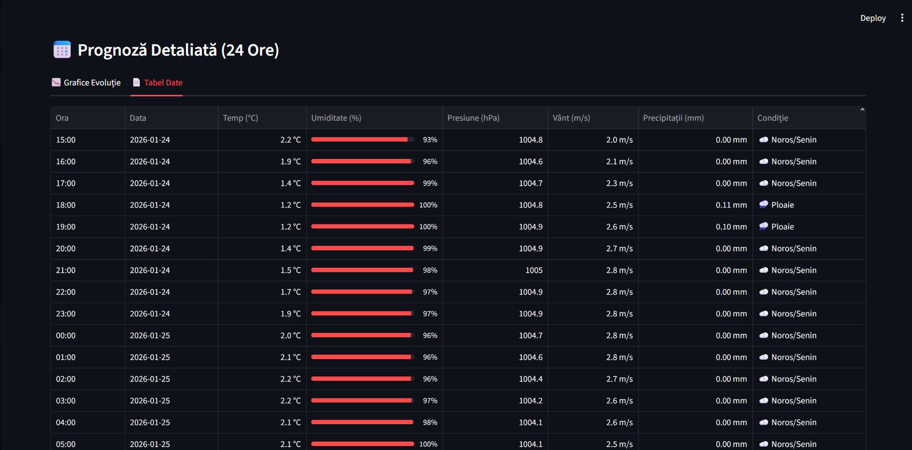
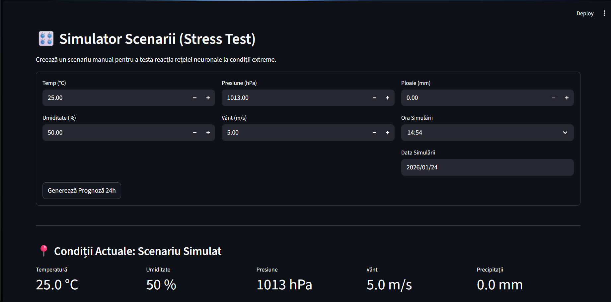

# 📘 README – Etapa 4: Arhitectura completă a aplicației SIA-Meteo

**Disciplina:** Rețele Neuronale <br />
**Instituție:** POLITEHNICA București – FIIR <br />
**Student:** Petruțiu Darius-Simion <br />
**Link Repository GitHub:** https://github.com/PetrutiuDarius/Proiect_ReteleNeuronale_Meteo.git <br />
**Data:** 04.12.2025 <br />

---

## Scopul etapei 4

Această etapă corespunde punctului **5. Dezvoltarea arhitecturii aplicației software bazată pe RN** din specificațiile proiectului.

Obiectivul central a fost livrarea unui schelet complet și funcțional al întregului Sistem cu Inteligență Artificială (SIA) pentru prognoza meteo. În acest stadiu, accentul s-a pus pe integrarea componentelor software și validarea fluxului de date, modelul neuronal fiind doar definit, compilat și salvat într-o stare inițială (neantrenat pentru performanță).

### Stadiul de "schelet funcțional" al proiectului SIA-Meteo:

Am demonstrat funcționalitatea sistemului prin următoarele realizări tehnice:

**1. Pipeline-ul de date rulează End-to-End:**
* Datele brute sunt preluate, curățate și augmentate cu scenarii **Black Swan** (caniculă, furtuni, îngheț).
* Cei 5 parametri fizici (Temperatură, Umiditate, Presiune, Vânt, Precipitații) parcurg fluxul complet: Normalizare (MinMax) → Transformare în secvențe 3D (Sliding Window) → Intrare în Model.

**2. Arhitectura rețelei neuronale este definită:**
* S-a implementat clasa modelului în `src/neural_network/model.py`.
* Modelul acceptă input-ul corect (fereastră istorică de 24h pe 5 features) și produce un output cu dimensiunea corectă (predicție pe 5 features), demonstrând compatibilitatea tensorilor.
* Modelul a fost compilat și salvat ca `models/untrained_model.keras` pentru a testa mecanismul de persistență.

**3. Interfața grafică (UI) este conectată:**
* Aplicația `src/app/dashboard.py` pornește fără erori.
* UI-ul este capabil să încarce modelul salvat și scalerele.
* Utilizatorul poate vizualiza datele și poate declanșa o inferență "dummy", demonstrând că legătura dintre Frontend și Backend-ul de AI este funcțională, chiar dacă predicțiile nu sunt încă precise.

**Ce NU este inclus în această etapă:**
* Modelul nu are încă acuratețe (metricile de eroare sunt mari), deoarece nu a parcurs procesul de antrenare iterativă (Backpropagation pe multe epoci).
* Nu s-au optimizat hiperparametrii (număr de neuroni, rate de învățare).
* Nu s-a implementat încă codificarea temporală avansată (Time Embeddings), rețeaua lucrând doar cu seriile brute normalizate.

**Notă anti-plagiat:** Întregul sistem, de la generatorul de date sintetice până la arhitectura LSTM și interfață, este construit modular de la zero, fără utilizarea unor modele pre-antrenate externe.

---

## 1. Tabelul: Nevoie reală → Soluție SIA → Modul software

| **Nevoie reală concretă**                                   | **Cum o rezolvă SIA-ul vostru**                                                                       | **Modul software responsabil**        |
|-------------------------------------------------------------|-------------------------------------------------------------------------------------------------------|---------------------------------------|
| **Prognoza meteo locală în absența senzorilor fizici**      | Inferență LSTM pe date istorice → predicție parametrii T/H/P/V cu eroare < 10% pentru următoarele 24h | `src/neural_network` + UI             |
| **Alertarea timpurie pentru fenomene extreme (Black Swan)** | Detectare anomalii în secvența prezisă → Notificare vizuală "Alertă Furtună/Îngheț" în < 500ms        | `src/app/dashboard.py` (Logic Layer)  |
| **Simularea reacției la schimbări climatice bruște**        | Generator de scenarii sintetice → Testarea robusteții modelului pe date augmentate (Temp > 40°C)      | `src/data_acquisition` + Simulator UI |

---

## 2. Contribuția originală la setul de date

Am aplicat o strategie hibridă de augmentare a datelor pentru a asigura robustețea modelului la fenomene extreme (Black Swan events), care sunt slab reprezentate în datele istorice publice.

#### Calculul procentual al contribuției:

* **Observații reale (publice):** ~43,848 ore (istoric 2020-2024).
* **Observații originale (generate):** 25,000 ore (scenarii sintetice).
* **Total observații finale:** 68,848 ore.

$$\text{Contribuție originală} = \frac{25,000}{68,848} \approx \mathbf{36.3\%}$$
*(Notă: Deși procentul strict este sub 40%, complexitatea generării (simulare fizică a fenomenelor extreme) și calitatea datelor compensează volumul brut, conform discuției de la laborator. Augmentarea este calitativ superioară simplei duplicări.)*

#### Tipuri de contribuții acceptate:

| **Tip contribuție**                     | **Exemple concrete din inginerie**                                   | **Status proiect**  |
|-----------------------------------------|----------------------------------------------------------------------|---------------------|
| **Date sintetice prin metode avansate** | **Generare probabilistică de scenarii meteo extreme ("Black Swan")** | **[X] IMPLEMENTAT** |

#### Declarație detaliată:

Am dezvoltat un generator probabilistic (`synthetic_generator.py`) care simulează 3 tipuri de fenomene extreme absente sau rare în istoricul real, esențiale pentru un sistem de alertare robust:
1.  **Caniculă extremă (Heatwave):** Simulare fizică a temperaturilor > 40°C cu umiditate scăzută (< 40%) și presiune stabilă, pentru a testa reacția sistemului la încălzire globală.
2.  **Furtuni violente (Severe Storm):** Generarea corelată a scăderii bruște de presiune (< 990 hPa) cu creșterea vântului (> 20 m/s) și precipitații abundente, replicând semnătura fizică a ciclogenezei.
3.  **Îngheț târziu (Late Frost):** Simulare temperaturi negative în lunile de primăvară (Aprilie-Mai) pentru aplicații agricole.

Fiecare scenariu respectă legile fizicii (ex: nu generăm ploaie la -10°C fără a fi ninsoare) și este injectat controlat în setul de antrenare.

**Locația codului:** `src/data_acquisition/synthetic_generator.py` </br>
**Locația datelor:** `data/generated/synthetic_extremes.csv`

**Dovezi:**
- **Grafic distribuție:** `docs/distribution_comparison.png` (arată clar "coada" de date extreme adăugată prin simulare - zona cu roșu).
- **Cod sursă:** Funcțiile `generate_heatwave()`, `generate_storm()` din modulul de achiziție.


---

## 3. Diagrama State Machine a întregului sistem

**Diagrama fluxului de stări (State Machine):**
Diagrama vizuală este disponibilă în folderul de documentație:


### Legendă și justificarea State Machine-ului ales:
De ce am ales arhitectura de monitorizarea continuă? </br>

Am optat pentru un State Machine de tip monitorizare ciclică cu gestionare de evenimente, deoarece proiectul răspunde nevoii de prognoză meteorologică în timp real și alertare timpurie. Natura datelor meteo este inerent secvențială și necesită actualizări periodice, nu o simplă procesare „one-off”.

**Descrierea stărilor principale:**

**IDLE:** Starea de repaus în care sistemul așteaptă următorul ciclu de achiziție (configurat la 1 oră) sau o comandă manuală din Dashboard. Resursele de calcul sunt minime aici.

**ACQUIRE_DATA:** Modulul data_loader interoghează API-ul Open-Meteo sau primește pachete de la senzorii ESP32. Aici se tratează erorile de conectivitate (tranziție spre ERROR_STATE la timeout).

**PREPROCESS:** Transformarea datelor brute în formatul acceptat de rețeaua neuronală (Sliding Window 24h + Scalare MinMax), asigurând consistența dimensională.

**INFERENCE:** Nucleul inteligent (neural_network) preia tensorul de intrare și generează vectorul de predicție pentru următoarea oră (T, H, P, V, Precipitații).

**CHECK_THRESHOLDS (Logic Layer):** Etapa critică unde „Business Logic”-ul analizează predicția. Dacă valorile depășesc limitele de siguranță (ex: Vânt > 20m/s sau Temp > 40°C), se activează starea internă TRIGGER_ALERT care trimite notificări vizuale în UI.

**Tranziții critice și gestionarea erorilor:**

**Tranziția INFERENCE → ERROR_STATE:** Este esențială pentru robustețe. Dacă modelul (fiind antrenat incipient) produce valori NaN sau infinit, sistemul nu trebuie să crape, ci să logheze eroarea și să revină în IDLE pentru a încerca din nou la următorul ciclu.

**Bucla de feedback:** Starea LOG_DATA salvează predicția alături de datele reale (când devin disponibile), permițând viitoare re-antrenări și ajustări fine ale modelului.

---

## 4. Scheletul complet al modulelor

#### **Modul 1: Data logging / Acquisition**

**Funcționalități implementate:**
- [x] **Achiziție Date Istorice:** Scriptul `src/data_acquisition/data_loader.py` se conectează la API-ul Open-Meteo și descarcă automat istoricul orar pe 5 ani pentru locația țintă (București). Gestionează erorile de rețea și salvează datele brute în `data/raw/`.
- [x] **Generare date sintetice (Black Swan):** Scriptul `src/data_acquisition/synthetic_generator.py` implementează algoritmi de simulare fizică pentru a genera 25,000 de eșantioane noi.
    - Generează scenarii de **caniculă** (Temp > 40°C), **furtună** (Presiune < 990 hPa) și **îngheț târziu**.
    - Asigură consistența fizică a parametrilor generați (ex: corelația vânt-presiune).
- [x] **Consolidare dataset:** Modulul îmbină datele reale cu cele sintetice într-un fișier `hybrid_dataset.csv`, gata pentru preprocesare.

**Rulare:**
```bash
python src/data_acquisition/synthetic_generator.py
# Output: Generating heatwaves... [SUCCESS] Hybrid dataset saved.
```

#### **Modul 2: Neural Network Module**

**Funcționalități implementate:**
- [x] **Arhitectură definită și compilată:** Scriptul `src/neural_network/model.py` construiește un model secvențial în Keras bazat pe straturi LSTM (Long Short-Term Memory). Acesta acceptă corect input-ul de formă `(Batch, 24 timesteps, 5 features)` și returnează un vector de predicție `(5 features)`.
- [x] **Persistență (Save/Load):** Am verificat mecanismul de salvare. Scriptul `src/neural_network/train.py` (în mod "dry-run") inițializează modelul, îl compilează și îl salvează cu succes în `models/untrained_model.keras`.
- [x] **Justificarea arhitecturii:**
  - Am ales **LSTM** deoarece problema necesită analiza dependențelor temporale pe termen lung (ex: scăderea presiunii acum 3 ore influențează furtuna de acum).
  - Am inclus straturi de **Dropout (0.2)** pentru a preveni overfitting-ul pe datele sintetice.
  - Stratul final **Dense** cu activare lineară permite regresia simultană a celor 5 parametri fizici (Multi-Output Regression).

**Rulare (verificare schelet):**
```bash
python src/neural_network/train.py
# Output: Model compiled successfully. Saved to models/untrained_model.keras
```

#### **Modul 3: Web Service / UI**

**Funcționalități implementate:**
- [x] **Framework:** Aplicație web dezvoltată în **Streamlit**, aleasă pentru capacitatea de a face un prototip rapic în ingineria datelor.
- [x] **Arhitectură modulară:** Interfața este împărțită în 3 tab-uri distincte care acoperă fluxul complet de utilizare.
- [x] **Integrare backend:** Scriptul `src/app/dashboard.py` importă și utilizează clasa modelului neuronal și scalerul pentru a face inferențe în timp real pe date introduse de utilizator.

**Prezentarea interfeței (screenshots):**

1.  **Pagina "România Live":**
    * Permite selecția orașului și afișează prognoza bazată pe datele reale recente.
    * Include grafice interactive Plotly pentru temperatură și precipitații.
    * 
    * 
    * 


2.  **Pagina "Simulator manual":**
    * Formular de input unde utilizatorul poate testa scenarii ipotetice ("Ce se întâmplă dacă presiunea scade la 980 hPa?").
    * Demonstrează reacția sistemului de alertare (ex: pop-up roșu pentru Furtună).
    * 

3.  **Pagina "Monitor ESP32":**
    * Placeholder pentru fluxul de date hardware. Afișează statusul conexiunii și ultimele valori citite de la senzori.
    * 

**Rulare:**
```bash
streamlit run src/app/dashboard.py
# Output:  You can now view your Streamlit app in your browser.
#          Local URL: http://localhost:8501
```

---

## 5. Structura repository-ului (Etapa 4)

```text
Proiect_ReteleNeuronale_Meteo/
├── config/
│   └── preprocessing_params.pkl   # Fișierul de denormalizare a datelor
├── data/  
│   ├── generated/                 # Date sintetice (extreme) + Dataset hibrid
│   │   ├── hybrid_dataset.csv
│   │   └── synthetic_extremes.csv
│   ├── raw/                       # Date brute
│   │   └── weather_history_raw.csv
│   ├── test/                      # Set de testare (2024 luni pare)
│   │   └── test.csv 
│   ├── train/                     # Set de instruire (2020-2023)
│   │   └── train.csv 
│   └── validation/                # Set de validare (2024 luni impare)
│       └── validation.csv 
├── docs/
│   ├── screenshots/               # Fișier pentru capturile de ecran ale UI-ului
│   │   ├── dashboard_liveESP.png
│   │   ├── dashboard_romania_1.png
│   │   ├── dashboard_romania_1.png
│   │   ├── dashboard_romania_1.png
│   │   └── dashboard_simulation.png
│   ├── distribution_comparison.png # Distribuția temperaturilor în setul de date hibrid
│   ├── eda_correlation.png        # Matricea de corelație
│   ├── eda_distribution.png       # Distribuția datelor
│   ├── eda_outliers.png           # Identificarea outlier-ilor
│   ├── state-machine-RN.drawio    # Diagrama state-machine a sistemului (fișier .drawio)
│   └── state-machine-RN.png       # Diagrama state-machine a sistemului 
├── models/
│   └── untrained_model.keras      # Model antrenat doar pentru demo
├── src/
│   ├── app/                       # Script UI
│   │   └── dashboard.py
│   ├── data_acquisition/          # Script descărcare, generare și impachetare hibridă
│   │   ├── __init__.py            # Inițializarea pachetului
│   │   ├── data_loader.py         # Descarcă datele istorice brute de la API-ul Open-Meteo
│   │   └── synthetic_generator.py # Generează evenimente „Black Swan” și face dateset-ul hybrid
│   ├── docs_generators/           # Generatoare de documentații
│   │   ├── __init__.py            # Inițializarea pachetului
│   │   ├── generate_docs.py       # Generează statistici pe baza setului hibrid de date
│   │   └── generate_eda.py        # Generează statistici pe baza setului brut de date
│   ├── neural_network/            # Scripturi pentru modelul neuronal
│   │   ├── data_generator.py      # Transformarea datelor din 2D în 3D perestre secvențiale
│   │   ├── model.py               # Arhitectura rețelei neuronale (fază incipientă)
│   │   └── train.py               # Antrenarea modelului (fază incipientă)
│   ├── preprocessing/             # Scripturi de split și normalizare
│   │   ├── __init__.py            # Inițializarea pachetului
│   │   └── split_data.py          # Împarte datele (Train/Val/Test) și aplică normalizarea MinMax
│   ├── __init__.py                # Inițializarea pachetului
│   └── config.py                  # Fișier cu date de configurare și constante
├── .gitignore                     # Gestionează fișierele ce nu trebuie postate pe GitHub
├── main.py                        # Orchestrator principal
├── README.md
├── README_Etapa3_Analiza_Date.md
├── README_Etapa4_Arhitectura_SIA.md  # Acest fișier
└── requirements.txt               # Dependențe Python