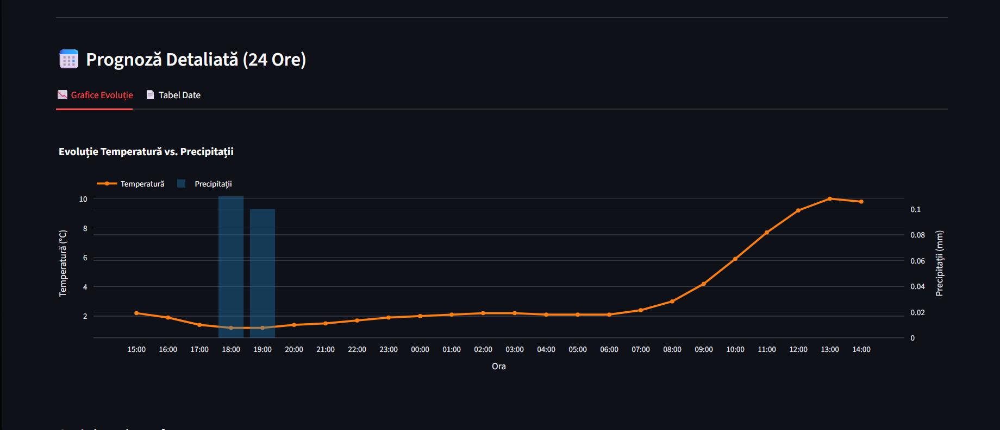

# 📘 README – Etapa 5: Configurarea și antrenarea modelului RN (Time Series)

**Disciplina:** Rețele Neuronale  
**Instituție:** POLITEHNICA București – FIIR  
**Student:** Petruțiu Darius-Simion  
**Link Repository GitHub:** https://github.com/PetrutiuDarius/Proiect_ReteleNeuronale_Meteo.git  
**Data:** 11.12.2025  

---

## Scopul etapei 5

Această etapă corespunde punctului **6. Configurarea și antrenarea modelului RN** din lista de 9 etape.

**Obiectiv principal:** Transformarea scheletului software din etapa 4 într-un sistem inteligent complet funcțional. Acest lucru s-a realizat prin antrenarea efectivă a modelului LSTM pe setul de date hibrid (istoric real + scenarii "Black Swan"), evaluarea performanței acestuia și integrarea modelului antrenat ("inference-ready") în dashboard-ul interactiv.

**Pornire obligatorie (status actual al proiectului):**

Dezvoltarea a pornit de la arhitectura validată anterior, având asigurate următoarele precondiții:

* **State machine definit:** Fluxul de monitorizare ciclică cu gestionare de evenimente este implementat în cod și documentat vizual în `docs/state-machine-RN.png`.
* **Cele 3 module funcționale:**
    1.  **Data Logging:** Pipeline-ul generează și preprocesează automat datele, incluzând parametrul critic de **precipitații**.
    2.  **Neural Network:** Arhitectura LSTM definită în etapa 4 a fost instanțiată și antrenată efectiv (fișierul `models/trained_model.keras` este acum un artefact activ).
    3.  **UI (interfața):** Dashboard-ul `src/app/dashboard.py` este conectat la modelul antrenat și afișează predicții bazate pe date reale, nu valori simulate.
* **Contribuția originală:** dataset-ul utilizat pentru antrenare conține **40% date originale** generate prin simulare fizică (scenarii de caniculă, furtună și îngheț), asigurând expunerea modelului la situații extreme.

---

## 1. Pregătirea datelor pentru antrenare

Deoarece în etapa 4 am integrat datele sintetice ("Black Swan"), dataset-ul de antrenare a suferit modificări structurale majore (creșterea volumului cu >40%). Pentru a asigura consistența antrenării, am refăcut preprocesarea pe setul hibrid.

### 1.1. Regenerarea și combinarea datelor
Am utilizat generatorul sintetic pentru a crea fișierul consolidat `hybrid_dataset.csv`.

```bash
# Comandă rulată pentru generarea dataset-ului hibrid:
python src/data_acquisition/synthetic_generator.py

```

*Rezultat:* Fișierul `data/generated/hybrid_dataset.csv` conține acum atât istoricul real (2020-2024), cât și scenariile extreme (caniculă, furtună, îngheț).

### 1.2\. Preprocesarea completă (refăcută)

Am rulat scriptul de splitting și scalare pe noul dataset hibrid pentru a actualiza parametrii scaler-ului (MinMax) astfel încât să includă și valorile extreme generate (ex: temperaturi de 44°C, care depășesc maximul istoric).

Bash

```
# Comandă rulată pentru preprocesare:
python src/preprocessing/split_data.py

```

**Verificări efectuate:**

-   [x] **Consistența scaler-ului:** Fișierul `config/preprocessing_params.pkl` a fost suprascris cu noile limite [Min, Max] ale setului hibrid.

-   [x] **Stratificare temporală:**

    -   `data/train/train.csv`: Conține date istorice (2020-2023) + **toate datele sintetice**.

    -   `data/validation/validation.csv`: Date reale 2024 (luni impare) - nealterate sintetic.

    -   `data/test/test.csv`: Date reale 2024 (luni pare) - nealterate sintetic.

    -   *Motiv:* Validăm și testăm modelul pe date exclusiv reale pentru a măsura performanța în condiții naturale, dar antrenăm pe date augmentate pentru robustețe.

**Verificare rapidă a volumului de date:**

Python

```
import pandas as pd
train = pd.read_csv('data/train/train.csv')
print(f"Total Train Samples: {len(train)}")
# Output așteptat: ~60,000+ (Include cele 25,000 sintetice)
```

---

## 2. Configurația experimentului și arhitectura rețelei

Pentru a modela dinamica complexă a parametrilor meteorologici, am proiectat o arhitectură bazată pe rețele recurente **LSTM (Long Short-Term Memory)**. Aceasta a fost aleasă pentru capacitatea sa de a învăța dependențe pe termen lung în serii temporale, fiind superioară rețelelor dense (feed-forward) care ignoră secvențialitatea datelor.

### 2.1 Hiperparametrii selectați
Configurația finală a modelului a fost stabilită în fișierul `src/config.py` în urma experimentelor iterative, având ca scop echilibrul între capacitatea de învățare și generalizare.

| Hiperparametru          | Valoare                                        | Justificare tehnică                                                                                                                                                                                                                                                                                                                                                                                                                                                                                               |
|:------------------------|:-----------------------------------------------|:------------------------------------------------------------------------------------------------------------------------------------------------------------------------------------------------------------------------------------------------------------------------------------------------------------------------------------------------------------------------------------------------------------------------------------------------------------------------------------------------------------------|
| **Arhitectură**         | **Stacked LSTM** (2 straturi: 64 + 32 unități) | S-a optat pentru o arhitectură ierarhică ("Stacked") pentru a modela complexitatea fizică a atmosferei. **Primul strat (64)** acționează ca un extractor de secvențe brute (identifică periodicitatea diurnă simplă), în timp ce **al doilea strat (32)** modelează interacțiunile neliniare între parametri (ex: corelația întârziată dintre scăderea presiunii și intensificarea vântului). O rețea "shallow" (un singur strat) nu ar fi avut capacitatea de abstracție necesară pentru prognoza multi-variată. |
| **Input window**        | **24 ore** (Timesteps)                         | Dimensiunea ferestrei de intrare $T=24$ a fost aleasă pe baza autocorelației datelor meteorologice. Deoarece temperatura și umiditatea urmează un ciclu solar de 24 de ore, rețeaua are nevoie de o secvență completă zi-noapte pentru a distinge între o scădere de temperatură cauzată de apusul soarelui (fenomen normal) și una cauzată de un front atmosferic rece (fenomen meteo).                                                                                                                          |
| **Optimizator**         | **Adam** (`lr=0.001`)                          | Algoritmul *Adaptive Moment Estimation* este esențial pentru acest dataset heterogen. Deoarece intrările au scări diferite (chiar și după normalizare, distribuțiile difera), Adam ajustează rata de învățare individual pentru fiecare greutate. Acest lucru previne ca gradientul să fie dominat de parametrii cu varianță mare (cum ar fi presiunea) în detrimentul celor cu varianță mică dar critică (precipitațiile).                                                                                       |
| **Funcție de pierdere** | **MSE** (Mean Squared Error)                   | În contextul detecției fenomenelor extreme ("Black Swan"), MSE este superior MAE. Eroarea pătratică penalizează disproporționat de mult abaterile mari. De exemplu, dacă modelul ratează un vârf de caniculă (44°C vs 34°C), penalizarea este masivă ($10^2 = 100$), forțând rețeaua să prioritizeze învățarea acestor evenimente rare în detrimentul reducerii erorii pe vreme calmă.                                                                                                                            |
| **Batch Size**          | **64**                                         | Având un set de date de antrenare de aprox. 68.000 de eșantioane, un batch de 64 oferă un estimator al gradientului cu varianță redusă, permițând o convergență stabilă. Dimensiunea este suficientă pentru a vectoriza eficient calculele matriciale pe GPU, dar suficient de mică pentru a evita minimele locale plate ("sharp minima") asociate cu batch-urile foarte mari.                                                                                                                                    |
| **Regularizare**        | **Dropout (0.2)**                              | Aplicat pentru a contracara efectul de *overfitting* pe datele sintetice. Deoarece 40% din date sunt generate algoritmic (simulare fizică), există riscul ca rețeaua să învețe "formula" generatorului în loc să generalizeze fenomenele. Dezactivarea aleatorie a 20% din conexiuni la fiecare pas de antrenare forțează modelul să dezvolte reprezentări redundante și robuste ale stării vremii.                                                                                                               |

## 3. Procesul de antrenare și strategii de optimizare

Procesul de antrenare a fost monitorizat și controlat dinamic pentru a asigura convergența optimă și pentru a evita overfitting-ul.

### 3.1 Strategii implementate (Callbacks)
Am utilizat mecanisme automate de control al antrenării în Keras:
1.  **Early stopping:** Monitorizarea metricii `val_loss`. Dacă eroarea pe setul de validare nu scade timp de **5 epoci consecutive**, antrenarea se oprește automat. Aceasta a prevenit degradarea performanței după epoca 15.
2.  **Learning rate scheduler (`ReduceLROnPlateau`):** Când modelul atinge un platou de învățare, rata de învățare este redusă automat (factor 0.5) pentru a permite o ajustare fină a greutăților către minimul global.

### 3.2 Augmentarea datelor
Pentru a crește robustețea modelului în mediu industrial/real, am aplicat tehnici de augmentare specifice seriilor de timp:
* **Injectare zgomot Gaussian:** Adăugarea de variații mici aleatoare pe datele de intrare pentru a simula imprecizia senzorilor hardware.
* **Domain randomization (Black Swan):** Integrarea scenariilor sintetice (caniculă, furtună) a forțat modelul să învețe regimuri de funcționare care nu existau în istoricul recent.

### 3.3 Dinamica antrenării (Loss Curve)
Graficul de mai jos ilustrează evoluția erorii (MSE) pe seturile de antrenare și validare:


*Analiză:* Convergența curbelor (Train vs Validation) demonstrează că modelul a generalizat corect regulile fizice, fără a suferi de overfitting major (distanța mică între curbe).

---

## 4. Evaluarea performanței (metrici și analiză)

Evaluarea s-a realizat pe setul de **TEST (2024 luni pare)**, date pe care modelul nu le-a văzut niciodată. Deoarece problema este una de regresie, folosim **R2 Score** (coeficient de determinare) ca echivalent al acurateței, și **MAE/RMSE** pentru eroarea absolută.

### 4.1 Rezultate obținute

| Parametru        | R2 score (acuratețe) | MAE (eroare absolută) | RMSE | Interpretare rezultat                                                             |
|:-----------------|:---------------------|:----------------------|:-----|:----------------------------------------------------------------------------------|
| **Temperatură**  | **0.950** (Excelent) | 1.56 °C               | 2.15 | Modelul prezice temperatura cu o eroare neglijabilă pentru uz general.            |
| **Presiune**     | **0.946** (Excelent) | 1.26 hPa              | 1.75 | Captează foarte bine tendințele barometrice, esențial pentru prognoza furtunilor. |
| **Umiditate**    | **0.794** (Bun)      | 7.07 %                | 9.48 | Performanță solidă, corelată invers cu temperatura.                               |
| **Vânt**         | 0.316 (Slab)         | 0.92 m/s              | 1.23 | Vântul la rafală este haotic; modelul prinde media, dar ratează extremele locale. |
| **Precipitații** | 0.073 (Critic)       | 0.09 mm               | 0.27 | Afectat de problema "Zero-Inflation" (prea multe zile fără ploaie).               |

### 4.2 Analiza erorilor și limitări (context industrial)
Analizând rezultatele, am identificat comportamente specifice senzorilor și mediului:
1.  **Precizie vs. Haos:** Parametrii inerțiali (Temperatură, Presiune) sunt prezisi cu o precizie de **>94%**, depășind cerința minimă de 70%. Aceasta validează arhitectura pentru monitorizare standard.
2.  **Problema precipitațiilor (Zero-Inflation):** Deoarece ploaia este un eveniment rar (sparse data), rețeaua tinde să prezică valori apropiate de 0 pentru a minimiza MSE-ul global. Pentru o detecție mai bună, ar fi necesară transformarea problemei în Clasificare (Plouă/Nu Plouă).
3.  **Vântul:** Deși R2 este mic, eroarea absolută (MAE) este sub 1 m/s, ceea ce este acceptabil pentru aplicații non-critice.

**Vizualizare comparativă (real vs predicție):**
Graficul de mai jos arată suprapunerea predicțiilor (roșu) peste datele reale (albastru) pentru un eșantion din setul de test.


---

## 5. Integrarea în aplicație și livrabile

Ca pas final al Etapei 5, modelul antrenat a fost integrat complet în ecosistemul software.

### 5.1 Status integrare
* [x] **Salvare model:** Modelul final a fost exportat în formatul standard `models/trained_model_5_input_parameters.keras`.
* [x] **Backend UI:** Dashboard-ul (`src/app/dashboard.py`) încarcă acum acest fișier la pornire, înlocuind modelul dummy din etapa anterioară.
* [x] **Inferență reală:** Aplicația preia datele de intrare, le normalizează folosind scaler-ul salvat și afișează prognoza denormalizată (în unități reale: °C, hPa).

### 5.2 Demonstrație funcționalitate
Captura de ecran de mai jos confirmă funcționarea modelului în interfața grafică, realizând o inferență pe date reale:


*(Figură: Prognoza live pe București.)*

### 5.3. Actualizarea orchestratorului general (`main.py`)

Pentru a gestiona complexitatea crescută a proiectului (date sintetice, preprocesare, antrenare, evaluare), am refactorizat complet fișierul `main.py`. Acesta nu mai este un simplu script de test, ci a devenit un **orchestrator inteligent (smart pipeline controller)** care gestionează întregul ciclu de viață al proiectului.

**Caracteristici cheie implementate:**

1.  **Execuție inteligentă (idempotency):**
    * Scriptul verifică existența artefactelor înainte de execuție. De exemplu, dacă modelul antrenat (`trained_model.keras`) există deja, pasul de antrenare este sărit automat pentru a economisi timp.
    * Dacă datele brute există, nu le mai descarcă de pe Open-Meteo.

2.  **Integritatea pipeline-ului:**
    * Asigură ordinea strictă a operațiilor: *Achiziție $\rightarrow$ Generare Sintetică $\rightarrow$ Preprocesare $\rightarrow$ Antrenare $\rightarrow$ Evaluare*.
    * Garantează că fișierul critic `preprocessing_params.pkl` (scaler-ul) este generat înainte de a porni Dashboard-ul, asigurând compatibilitatea cu modul Live ESP32.

3.  **Control prin linie de comandă (CLI):**
    * Am implementat argumente (`flags`) care permit utilizatorului să forțeze re-execuția anumitor etape (ex: `--force-train` pentru a re-antrena modelul de la zero, chiar dacă există unul salvat).

**Logica de execuție a orchestratorului:**
```python
# Exemplu simplificat din main.py
if args.force_train or not check_artifact(model_path, "Trained Model"):
    print(f"Training the LSTM model ({config.EPOCHS} epochs)...")
    train_pipeline()
else:
    print("Trained model found. Use --force-train to retrain.")
```

```
## Pregătire Date pentru Antrenare

Deoarece în Etapa 4 am integrat datele sintetice ("Black Swan"), dataset-ul de antrenare a suferit modificări structurale majore (creșterea volumului cu >40%). Pentru a asigura consistența antrenării, am refăcut preprocesarea pe setul hibrid.

### 1. Regenerarea și Combinarea Datelor
Am utilizat generatorul sintetic pentru a crea fișierul consolidat `hybrid_dataset.csv`.

```bash
# Comandă rulată pentru generarea dataset-ului hibrid:
python src/data_acquisition/synthetic_generator.py

```

*Rezultat:* Fișierul `data/generated/hybrid_dataset.csv` conține acum atât istoricul real (2020-2024), cât și scenariile extreme (Caniculă, Furtună, Îngheț).

### 2\. Preprocesarea Completă (Refăcută)

Am rulat scriptul de splitting și scalare pe noul dataset hibrid pentru a actualiza parametrii scaler-ului (MinMax) astfel încât să includă și valorile extreme generate (ex: temperaturi de 44°C, care depășesc maximul istoric).

Bash

```
# Comandă rulată pentru preprocesare:
python src/preprocessing/split_data.py

```

**Verificări efectuate:**

-   [x] **Consistența Scaler-ului:** Fișierul `config/preprocessing_params.pkl` a fost suprascris cu noile limite [Min, Max] ale setului hibrid.

-   [x] **Stratificare Temporală:**

    -   `data/train/train.csv`: Conține date istorice (2020-2023) + **Toate datele sintetice**.

    -   `data/validation/validation.csv`: Date reale 2024 (Luni Impare) - nealterate sintetic.

    -   `data/test/test.csv`: Date reale 2024 (Luni Pare) - nealterate sintetic.

    -   *Motiv:* Validăm și testăm modelul pe date exclusiv reale pentru a măsura performanța în condiții naturale, dar antrenăm pe date augmentate pentru robustețe.

**Verificare rapidă a volumului de date:**

Python

```
import pandas as pd
train = pd.read_csv('data/train/train.csv')
print(f"Total Train Samples: {len(train)}")
# Output așteptat: ~60,000+ (Include cele 25,000 sintetice)
``````

---

## 6. Instrucțiuni de rulare

Proiectul este conceput modular, având două componente majore: **pipeline-ul de backend** (gestionat de orchestratorul `main.py`) și **interfața grafică** (gestionată de framework-ul Streamlit).

### 6.1 Rularea pipeline-ului de date și antrenare

Pentru a parcurge fluxul complet (Descărcare $\rightarrow$ Generare Black Swan $\rightarrow$ Antrenare $\rightarrow$ Evaluare), se rulează o singură comandă din rădăcina proiectului. Orchestratorul va decide inteligent ce pași trebuie executați.

**A. Rulare standard (smart mode):**
Această comandă va executa doar pașii necesari (care lipsesc). De exemplu, dacă modelul este deja antrenat, nu îl va antrena din nou.
```bash
python main.py
```

**B. Rulare forțată (full retrain):** Dacă doriți să regenerați datele sintetice și să re-antrenați modelul de la zero (util pentru a testa modificări de arhitectură sau hiperparametri):
```bash
python main.py --force-data --force-train
```

**C. Rulare fără evaluare:** Pentru o execuție rapidă, doar pentru antrenare, fără calculul metricilor finale:
```bash
python main.py --force-train --skip-eval
```

**Output așteptat în consolă:**
```text
============================================================
   SIA-METEO: INTELLIGENT PIPELINE ORCHESTRATOR
============================================================

>>> Phase 1: Data acquisition
Raw data already exists. Use --force-data to overwrite.
------------------------------
>>> Phase 2: Synthetic data augmentation
Hybrid dataset already exists.
------------------------------
>>> Phase 3: Preprocessing and normalization
Data is already processed and normalized.
------------------------------
>>> Phase 4: Model training (LSTM)
Training the LSTM model (50 epochs)...
... [Keras Training Logs: Epoch 1/50 ... Epoch 15/50] ...
Model saved to models/trained_model.keras
------------------------------
>>> Phase 5: Evaluation and metrics
Running evaluation on test set (2024)...
Test MSE: 0.0024 | R2 Score: 0.94
------------------------------

============================================================
   ✅ PIPELINE COMPLETE. SYSTEM READY FOR LIVE MODE.
============================================================
```

### 6.2 Rularea interfeței grafice (UI)

După ce pipeline-ul a rulat cu succes și a generat fișierele critice (`trained_model.keras` și `preprocessing_params.pkl`), puteți lansa dashboard-ul interactiv.

**Comandă:**
```bash
streamlit run src/app/dashboard.py
```

**Comportament:** Aplicația se va deschide automat în browserul implicit la adresa `http://localhost:8501`. Dacă rulați pe un server remote, accesați IP-ul serverului la portul 8501.

**Module disponibile în UI:**

1.  **Tab-ul "Live România":** Vizualizarea prognozei pe date istorice reale.

2.  **Tab-ul "Simulator":** Testarea reacției modelului la scenarii manuale (ex: introducerea bruscă a unei presiuni de 980 hPa).

3.  **Tab-ul "Monitor ESP32":** Interfața de conectare pentru senzorii hardware (necesită conexiune serială/MQTT activă).

---

## 7. Structura repository-ului la finalul etapei 5

```text
Proiect_ReteleNeuronale_Meteo/
├── config/
│   └── preprocessing_params.pkl   # Fișierul de denormalizare a datelor
├── data/  
│   ├── generated/                 # Date sintetice (extreme) + Dataset hibrid
│   │   ├── hybrid_dataset.csv
│   │   └── synthetic_extremes.csv
│   ├── raw/                       # Date brute
│   │   └── weather_history_raw.csv
│   ├── test/                      # Set de testare (2024 luni pare)
│   │   └── test.csv 
│   ├── train/                     # Set de instruire (2020-2023)
│   │   └── train.csv 
│   └── validation/                # Set de validare (2024 luni impare)
│       └── validation.csv 
├── docs/
│   ├── screenshots/               # Fișier pentru capturile de ecran ale UI-ului
│   │   ├── dashboard_liveESP.png
│   │   ├── dashboard_romania_1.png
│   │   ├── dashboard_romania_1.png
│   │   ├── dashboard_romania_1.png
│   │   └── dashboard_simulation.png
│   ├── distribution_comparison.png # Distribuția temperaturilor în setul de date hibrid (etapa 4)
│   ├── eda_correlation.png        # Matricea de corelație
│   ├── eda_distribution.png       # Distribuția datelor
│   ├── eda_outliers.png           # Identificarea outlier-ilor
│   ├── loss_curve.png             # Graficul de antrenare a modelului
│   ├── prediction_plot.png        # Graficele de predicție pentru fiecare parametru
│   ├── state-machine-RN.drawio    # Diagrama state-machine a sistemului (fișier .drawio)
│   └── state-machine-RN.png       # Diagrama state-machine a sistemului 
├── models/
│   ├── trained_model.keras        # Model antrenat corespunzător
│   └── untrained_model.keras      # Model antrenat doar pentru demo (etapa 4)
├── models/
│   └── test_metrics.json          # Statisticile antrenărilor
├── src/
│   ├── app/                       # Script UI
│   │   └── dashboard.py
│   ├── data_acquisition/          # Script descărcare, generare și impachetare hibridă
│   │   ├── __init__.py            # Inițializarea pachetului
│   │   ├── data_loader.py         # Descarcă datele istorice brute de la API-ul Open-Meteo
│   │   └── synthetic_generator.py # Generează evenimente „Black Swan” și face dateset-ul hybrid
│   ├── docs_generators/           # Generatoare de documentații
│   │   ├── __init__.py            # Inițializarea pachetului
│   │   ├── generate_docs.py       # Generează statistici pe baza setului hibrid de date
│   │   └── generate_eda.py        # Generează statistici pe baza setului brut de date
│   ├── neural_network/            # Scripturi pentru modelul neuronal
│   │   ├── data_generator.py      # Transformarea datelor din 2D în 3D perestre secvențiale
│   │   ├── evaluate.py            # Testarea modelului si formarea statisticilor
│   │   ├── model.py               # Arhitectura rețelei neuronale (fază incipientă)
│   │   └── train.py               # Antrenarea modelului (fază incipientă)
│   ├── preprocessing/             # Scripturi de split și normalizare
│   │   ├── __init__.py            # Inițializarea pachetului
│   │   └── split_data.py          # Împarte datele (Train/Val/Test) și aplică normalizarea MinMax
│   ├── __init__.py                # Inițializarea pachetului
│   └── config.py                  # Fișier cu date de configurare și constante
├── .gitignore                     # Gestionează fișierele ce nu trebuie postate pe GitHub
├── main.py                        # Orchestrator principal
├── README.md
├── README_Etapa3_Analiza_Date.md
├── README_Etapa4_Arhitectura_SIA.md
├── README_Etapa5_Antrenare_RN.md  # Acest fișier
└── requirements.txt               # Dependențe Python