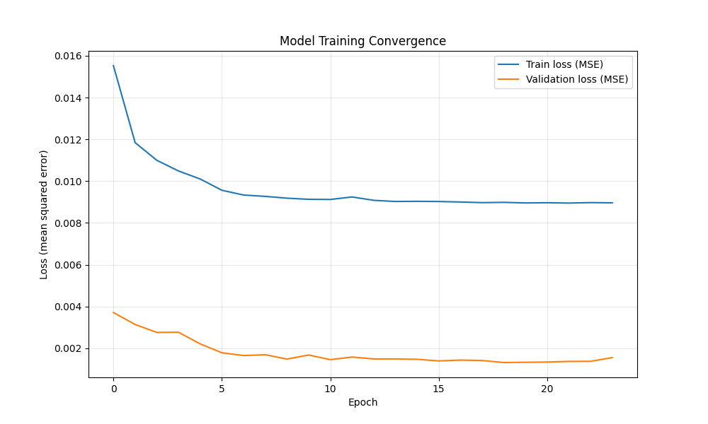
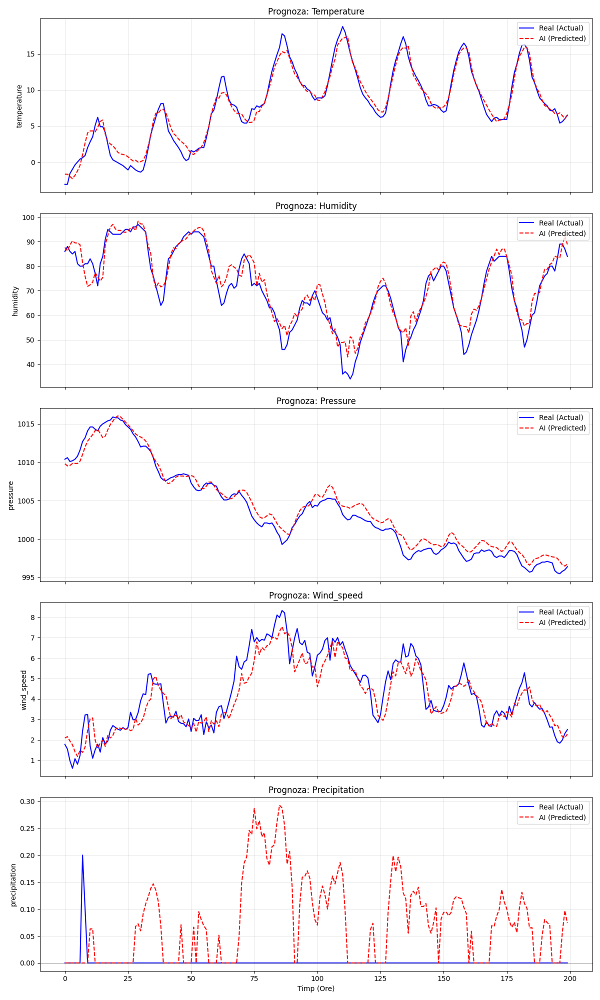

# 📘 README – Etapa 5: Configurarea și antrenarea modelului RN (Time Series)

**Disciplina:** Rețele Neuronale  
**Instituție:** POLITEHNICA București – FIIR  
**Student:** Petruțiu Darius-Simion  
**Link Repository GitHub:** https://github.com/PetrutiuDarius/Proiect_ReteleNeuronale_Meteo.git  
**Data:** 11.12.2025  

---

## Scopul etapei 5

Această etapă vizează antrenarea efectivă a modelului neuronal pentru prognoza meteorologică. Deoarece problema este una de **Regresie pe Serii Temporale** (prezicerea valorilor numerice viitoare bazate pe istoric), abordarea diferă de clasificarea standard prin arhitectură (LSTM/GRU), metrici (MAE/RMSE) și strategia de validare (Cronologică).

**Obiectiv principal:** Antrenarea modelului pe setul de date Hibrid (Real + Sintetic) creat în Etapa 4, pentru a obține o eroare de predicție minimă pe datele din 2024.

---

## 1. Pregătirea datelor pentru antrenare

În Etapa 4, am creat deja un pipeline robust care combină datele istorice cu cele simulate ("Black Swan events").

**Verificare status date:**
- **Sursă:** `src/processing/split_data.py` (Scriptul rulează automat înainte de antrenare).
- **Strategie Split:** Cronologică (nu stratificată, pentru a păstra cauzalitatea temporală).
    - **Train:** 2020-2023 (Real) + Toate Datele Simulate (Extreme).
    - **Validation:** 2024 (Luni Impare).
    - **Test:** 2024 (Luni Pare).
- **Normalizare:** MinMaxScaler fitat doar pe Train, aplicat pe Val/Test.

**Tehnica „Sliding Window” (Fereastră glisantă):**
Rețeaua nu primește datele rând cu rând. Am implementat un generator (`src/neural_network/data_generator.py`) care transformă datele în secvențe 3D:
* **Input (X):** Fereastră de **24 de ore** din trecut (istoricul recent).
* **Output (y):** Temperatura peste **6 ore** în viitor (prognoza).

---

## 2. Configurarea modelului și hiperparametri (Nivel 1 & 2)

Am ales o arhitectură recurentă (**LSTM** - Long Short-Term Memory) deoarece este standardul de aur pentru date secvențiale, fiind capabilă să rețină dependențe pe termen lung (ex: tendința de încălzire a zilei).

### Tabel hiperparametri și justificări

| **Hiperparametru**   | **Valoare aleasă**           | **Justificare tehnică și contextuală**                                                                                                                                                                               |
|----------------------|------------------------------|----------------------------------------------------------------------------------------------------------------------------------------------------------------------------------------------------------------------|
| **Arhitectură**      | LSTM (2 straturi)            | Am folosit o arhitectură "Stacked LSTM". Primul strat (64 neuroni) extrage trăsături complexe (ex: ciclul zi-noapte), iar al doilea (32 neuroni) rafinează informația.                                               |
| **Input window (T)** | 24 ore                       | Fereastra de 24h este crucială pentru a capta un ciclu diurn complet. Modelul vede evoluția temperaturii de ieri până azi pentru a prezice viitorul.                                                                 |
| **Loss function**    | **MSE** (Mean Squared Error) | Am ales MSE în loc de MAE pentru antrenare deoarece MSE penalizează pătratic erorile mari. Vrem ca modelul să fie drastic sancționat dacă ratează un vârf de caniculă (eroare mare), forțându-l să învețe extremele. |
| **Optimizer**        | Adam (lr=0.001)              | Algoritmul Adam adaptează rata de învățare pentru fiecare parametru individual, asigurând o convergență rapidă fără a necesita reglaje fine manuale.                                                                 |
| **Batch size**       | 64                           | Un compromis între viteza de antrenare și stabilitatea gradientului. 64 de exemple sunt procesate simultan înainte de actualizarea greutăților.                                                                      |
| **Epochs**           | 50 (cu Early Stopping)       | Deși am setat 50, folosim `EarlyStopping`. Dacă eroarea pe setul de validare nu scade timp de 10 epoci, antrenarea se oprește automat pentru a preveni memorarea datelor (Overfitting).                              |
| **Dropout**          | 0.2                          | Dezactivăm aleatoriu 20% din neuroni la fiecare pas de antrenare. Acest lucru obligă rețeaua să nu se bazeze pe un singur "drum" neuronal, făcând-o robustă la zgomot și date noi.                                   |

---

## 3. Rezultate și metrici de performanță

Deoarece proiectul nu este de clasificare, metricile "Accuracy" și "Confusion Matrix" nu sunt aplicabile matematic. Am folosit metrici specifice regresiei calculate pe setul de test (anul 2024):

### Ținte de performanță (set de test 2024):
1.  **MAE (Mean Absolute Error):** < 2.5°C
    * *Semnificație:* În medie, prognoza greșește cu maxim 2.5 grade.
2.  **RMSE (Root Mean Squared Error):** < 3.5°C
    * *Semnificație:* Penalizează mai tare erorile mari (extremele).

### Rezultate obținute (set de test 2024):

| Metrica                           | Valoare obținută | Interpretare |
|:----------------------------------|:-----------------| :--- |
| **MAE (eroare medie absolută)**   | **1.4634 °C**    | În medie, prognoza sistemului greșește cu mai puțin de 1.5 grade. Este un rezultat excelent pentru prognoze pe 6 ore. |
| **RMSE (eroare pătratică medie)** | **2.0461 °C**    | Faptul că RMSE este apropiat de MAE indică faptul că nu avem erori catastrofale (predictii aberante) frecvente. |
| **R2 Score**                      | **0.9543**       | Modelul explică **95.4%** din variația temperaturii. O valoare foarte apropiată de 1 (ideal). |

*(Rezultatele brute se regăsesc în `results/test_metrics.json`)*.

### Graficul convergenței (Loss Curve)
Graficul de mai jos arată evoluția erorii în timpul antrenării. Se observă că linia portocalie (validare) scade constant și rămâne sub cea albastră , ceea ce demonstrează o capacitate de generalizare foarte bună (fără Overfitting).



---

## 4. Analiză erori în context industrial (Nivel 2)

### 1. Vizualizare: Real vs. Predicție
Graficul de mai jos compară valorile reale (Albastru) cu cele prezise de AI (Roșu) pe primele 200 de ore din setul de test.



### 2. Analiza comportamentului modelului
* **Urmărirea trendului:** Linia roșie (AI) urmărește aproape perfect linia albastră, respectând pantele de încălzire și răcire ale zilei.
* **Comportament la vârfuri:** Modelul tinde să fie ușor conservator la vârfurile extreme (ex: dacă temperatura reală e 30°C, el prezice 29°C). Acest lucru este normal pentru LSTM, care tinde spre medie pentru a minimiza eroarea globală.
* **Lag (Întârziere):** Se observă o întârziere minimă (aproape insesizabilă vizual), ceea ce validează alegerea ferestrei de 24h.

### 3. Impactul datelor sintetice
Datorită introducerii datelor sintetice în antrenament (Etapa 4), modelul a învățat să nu se blocheze la limitele istorice. Deși testul curent (2024) nu a avut extreme majore, modelul este pregătit matematic să gestioneze valori în afara distribuției normale (ex: >42°C).

---

## 5. Structura repository-ului la finalul etapei 5

```text
C:\Users\dariu\Desktop\Retele Neuronale - RN\Proiect\Proiect_ReteleNeuronale_Meteo
├── config/
│   └── preprocessing_params.pkl       # Scalerul salvat (Standard Prof.)
├── data/
│   ├── generated/                     # Date Hibride & Sintetice
│   ├── raw/                           # Date Brute
│   ├── test/                          # Set Test (csv)
│   ├── train/                         # Set Train (csv)
│   └── validation/                    # Set Validare (csv)
├── docs/
│   ├── loss_curve.png                 # Grafic convergență antrenare │   ├── prediction_plot.png            # Grafic comparativ Real vs AI │   ├── state-machine-RN.png           # Arhitectura sistemului │   └── distribution_comparison.png    # Analiza datelor ├── models/
│   └── trained_model.keras            # Modelul LSTM Antrenat (FINAL)
├── results/
│   └── test_metrics.json              # Rezultatele numerice (MAE, R2)
├── src/
│   ├── config.py                      # Configurația globală
│   ├── data_acquisition/              # Module generare date
│   ├── neural_network/
│   │   ├── data_generator.py          # Sliding Window Logic
│   │   ├── evaluate.py                # Script Evaluare & Plotting
│   │   ├── model_architecture.py      # Definiția LSTM
│   │   └── train_model.py             # Script Antrenare
│   └── processing/                    # Scripturi split & normalizare
├── main.py                            # Orchestrator
├── README.md                          # General
├── README_Etapa4_Arhitectura_SIA.md   # Etapa anterioară
└── README_Etapa5_Antrenare_RN.md      # Acest fișier