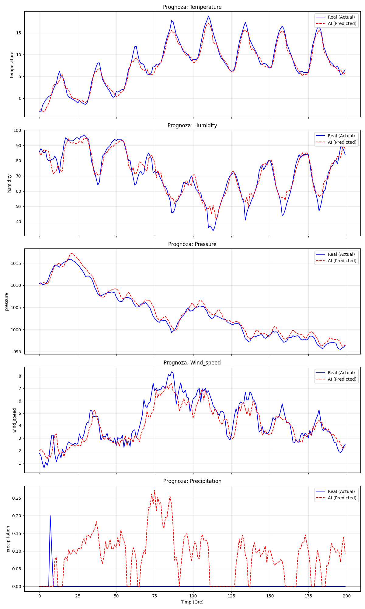
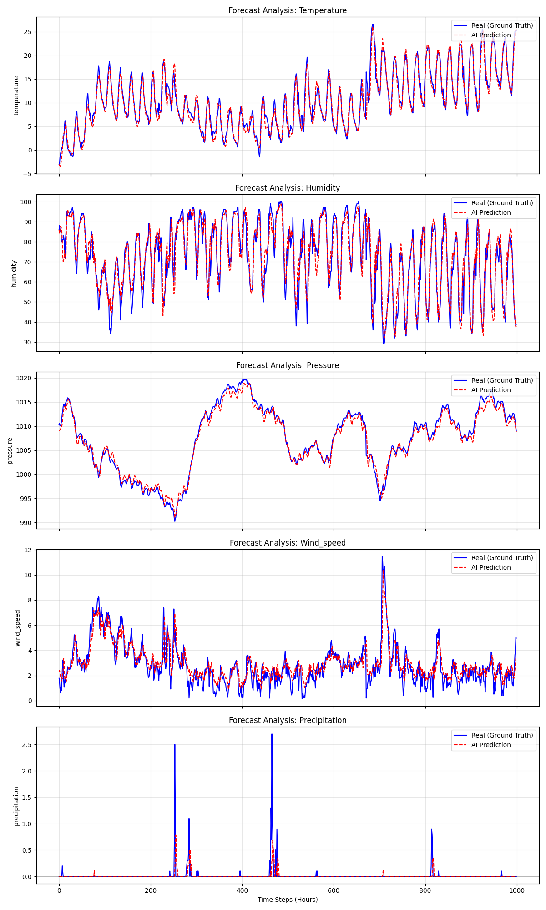
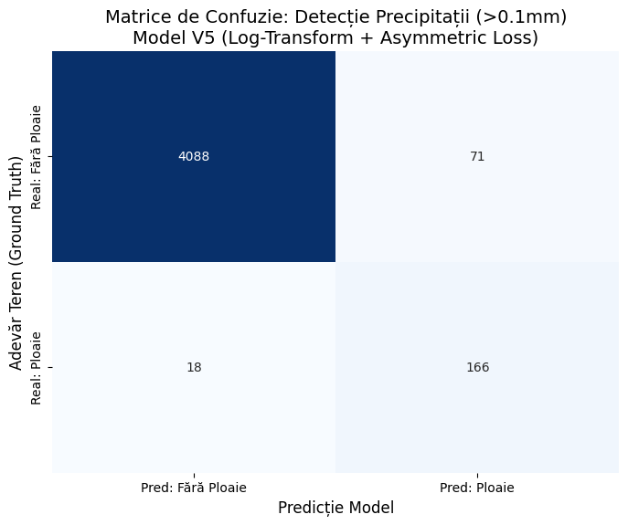
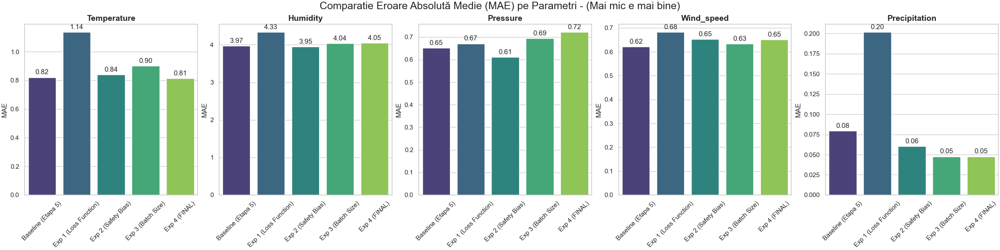
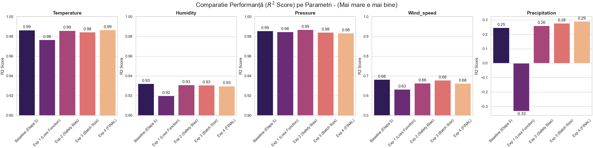
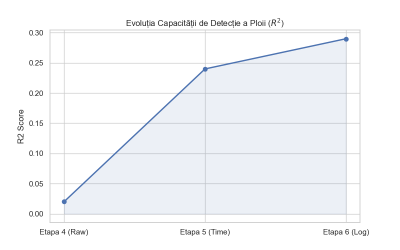
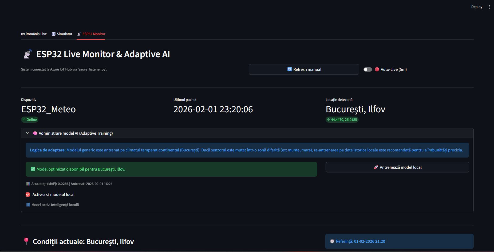
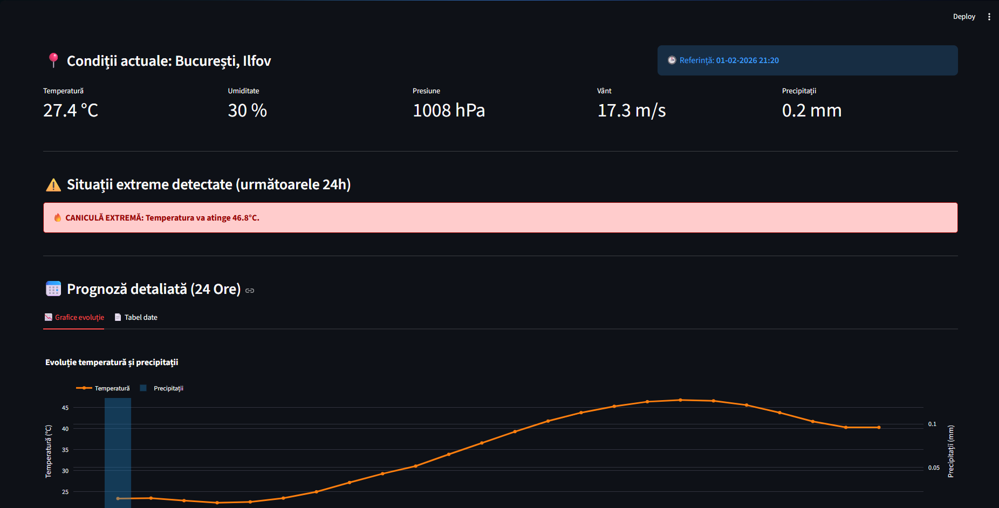
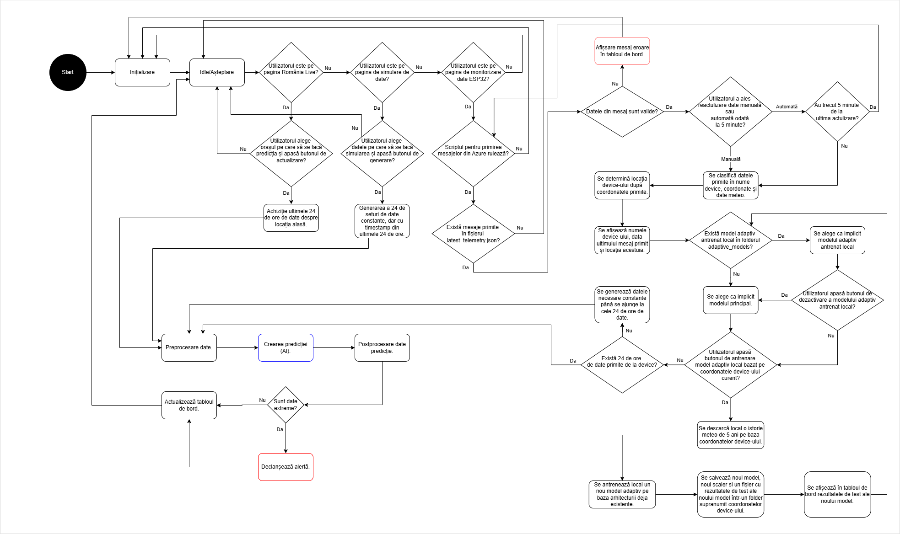
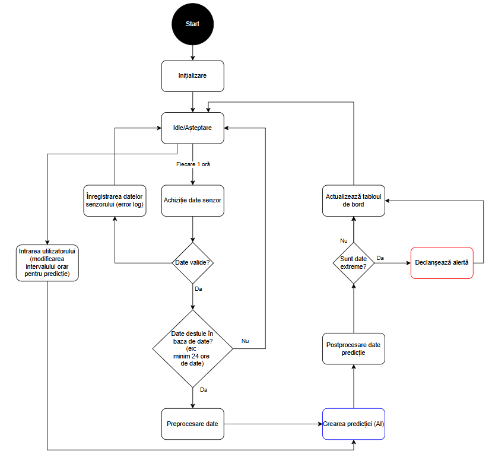

# 📘 README – Etapa 6: Analiza performanței, optimizarea și concluzii finale

**Disciplina:** Rețele Neuronale  
**Instituție:** POLITEHNICA București – FIIR  
**Student:** Petruțiu Darius-Simion  
**Link Repository GitHub:** https://github.com/PetrutiuDarius/Proiect_ReteleNeuronale_Meteo.git  
**Data predării:** 15.01.2026

---

## Scopul etapei 6

Această etapă marchează maturizarea completă a Sistemului cu Inteligență Artificială (SIA). Ea corespunde punctelor **7. Analiza performanței și optimizarea parametrilor**, **8. Analiza și agregarea rezultatelor** și **9. Formularea concluziilor finale** din specificațiile proiectului.

### Obiectiv principal
Obiectivul central al acestei etape este tranziția de la un prototip funcțional (livrat în etapa 5) la un **produs software matur, optimizat și validat industrial**. Aceasta implică nu doar rafinarea hiperparametrilor modelului neuronal, ci și implementarea unor mecanisme avansate de adaptabilitate (Adaptive AI) și consolidarea arhitecturii software pentru a asigura robustețea în scenarii reale.

### Contextul dezvoltării
* **Iterativitate:** Pe baza analizei de performanță din această etapă, s-au efectuat actualizări retroactive asupra componentelor din etapele anterioare (ex: rafinarea setului de date în Etapa 3, ajustarea arhitecturii LSTM în Etapa 4).
* **Produs final:** Rezultatul este o aplicație completă, capabilă să preia date de la senzori IoT, să le proceseze în Cloud (Azure), să genereze prognoze prin rețele neuronale și să se adapteze dinamic la noi locații geografice.

### Diferențiatori față de etapa 5
| Caracteristică  | Etapa 5 (prototip)             | Etapa 6 (versiune finală)                                         |
|:----------------|:-------------------------------|:------------------------------------------------------------------|
| **Model AI**    | Antrenat static (București)    | **Adaptiv** (Re-antrenare on-demand pentru orice locație)         |
| **Arhitectură** | Monolitică (Streamlit blocant) | **Decuplată** (Producer-Consumer via Azure Listener)              |
| **Data Flow**   | Unidirecțional                 | **Bidirecțional** (Feedback loop pentru predicții auto-regresive) |
| **Performanță** | Baseline (F1 > 0.60)           | **Optimizat** (Loss Asimetric pentru fenomene rare)               |
| **UX/UI**       | Afișare simplă                 | **Geolocație inversă, Notificări Toast, Data Healing**            |

---

## 1. Experimente de optimizare și evoluție a modelului

Această secțiune documentează procesul iterativ de rafinare a componentei de inteligență artificială. Plecând de la un model baseline simplu, am rulat o serie de experimente sistematice pentru a îmbunătăți acuratețea prognozei, capacitatea de generalizare și stabilitatea fizică a predicțiilor.

Pentru a ajunge la rezultatele finale, am adoptat o strategie de **optimizare iterativă manuală**, bazată pe analiza vizuală a comportamentului modelului și înțelegerea fizică a datelor, nu doar pe maximizarea oarbă a unor metrici.

**Abordare:**
În loc de un "Grid Search" automatizat exhaustiv, am preferat să ghidez antrenarea prin intuiție inginerească, rulând aproximativ **20 de experimente manuale**. Datorită timpului de antrenare redus al arhitecturii LSTM optimizate, am putut itera rapid, observând imediat defectele logice ale modelului (ex: "ploaia fantomă" sau instabilitatea la vânt) și intervenind direct asupra cauzei.

**Axe de optimizare explorate:**
1.  **Volumul datelor (trade-off eficiență):** Am testat antrenarea pe un istoric extins de **6 ani** comparativ cu fereastra standard de **4 ani** (2020-2023).
    * *Observație:* Diferența de performanță a fost neglijabilă (sub 0.5% îmbunătățire la $R^2$), însă timpul de antrenare și consumul de RAM creșteau semnificativ.
    * *Decizie:* Am optat pentru dataset-ul de 4 ani pentru a menține aplicația portabilă și rapidă, fără a sacrifica precizia.
2.  **Preprocesare:** Transformarea logaritmică a precipitațiilor a avut un impact mai mare decât orice modificare de hiperparametri (număr de neuroni sau straturi).
3.  **Funcția de cost:** Am experimentat progresiv cu MSE, Weighted MSE și Asymmetric Loss pentru a forța modelul să învețe evenimentele rare.

**Buget computațional:**
Procesul s-a bazat pe frecvența ridicată a testelor (Fast Fail), fiecare antrenament durând între 10-15 minute, ceea ce a permis rafinarea rapidă a soluției.

### 1.1. Tabel comparativ al versiunilor

Am desfășurat 5 iterații majore și 2 experimente secundare. Mai jos este rezumatul impactului fiecărei modificări arhitecturale asupra performanței modelului.

| Versiune                     | Modificare principală                                  | Justificare tehnică                                                                                 | Impact observat ($R^2$ & comportament)                                                                                              |
|:-----------------------------|:-------------------------------------------------------|:----------------------------------------------------------------------------------------------------|:------------------------------------------------------------------------------------------------------------------------------------|
| **V1.0 (Baseline)**          | 5 Input Features (Temp, Hum, Pres, Wind, Rain)         | Abordare standard de tip "Raw Data". Modelul primește doar valorile fizice brute.                   | Performanță modestă. Modelul nu distingea ciclul zi/noapte. Erori mari la predicția vântului ($R^2 \approx 0.3$).                   |
| **V1.1 (Data Augmentation)** | Calibrare date sintetice "Black Swan"                  | Reducerea intensității ploii sintetice (de la 50mm la 15mm/h) pentru a reflecta realismul climatic. | Eliminarea "halucinațiilor" modelului (ploi torențiale false). $R^2$ la precipitații a devenit pozitiv.                             |
| **V2.0 (Time Embeddings)**   | **Adăugare 4 Time Embeddings** (Sin/Cos Day/Year)      | Introducerea ciclicității matematice. Rețeaua LSTM primește explicit ora și anotimpul.              | **Salt major de performanță:** Temp $R^2 \rightarrow 0.98$, Vânt $R^2 \rightarrow 0.67$. Modelul a "învățat" că noaptea e mai frig. |
| **V2.1 (Physics-Informed)**  | Post-procesare cu constrângeri fizice                  | Corecția ieșirilor imposibile fizic (ex: ploaie negativă, umiditate > 100%).                        | Grafice de predicție curate, eliminarea zgomotului de fond (<0.1mm precipitații).                                                   |
| **V3.0 (Weighted Loss)**     | Introducere `Weighted MSE`                             | Penalizarea mai dură a erorilor pe valorile extreme (vârfuri de grafic).                            | Îmbunătățire ușoară pe extreme, dar instabilitate pe valorile medii. Abandonat.                                                     |
| **V4.0 (Asymmetric Loss)**   | Funcție de cost asimetrică                             | Penalizarea supra-estimării ploii de 20x mai mult decât sub-estimarea.                              | **Critic pentru siguranță:** Modelul nu mai spune că plouă când defapt nu plouă, preferând abținerea în locul omiterii.             |
| **V5.0 (Log-Transform)**     | **Transformare logaritmică precipitații** (`np.log1p`) | Compresia gamei dinamice a ploii (0-100mm) pentru a facilita convergența gradientului.              | **BEST MODEL.** Stabilitate maximă. Convergență rapidă și eroare MAE minimă pe ploaie.                                              |
| *V5.1 (Experimental)*        | Batch Size 128 (vs 64)                                 | Încercare de accelerare a antrenării prin paralelizare masivă.                                      | Degradare ușoară a generalizării. Modelul converge spre o soluție locală mai slabă.                                                 |

---

### 1.2. Analiza detaliată a experimentelor cheie

În continuare, detaliem cele mai importante trei momente de "breakthrough" în evoluția modelului.

#### Experiment V2.0: Integrarea "Time Embeddings" (conștientizarea timpului)
În versiunea Baseline (V1.0), modelul primea doar șirul de temperaturi, fără să știe dacă acele temperaturi sunt la prânz sau la miezul nopții. Acest lucru crea confuzie în rețea (ex: 20°C la prânz înseamnă răcire, 20°C noaptea înseamnă caniculă).

**Soluția:** Am transformat timestamp-ul liniar în 4 semnale ciclice continue:
* `Day Sin/Cos`: Indică momentul zilei (Răsărit/Apus).
* `Year Sin/Cos`: Indică anotimpul (Vara/Iarna).

**Rezultate cantitative:**
* **Temperatură:** $R^2$ a atins o valoare excelentă de **0.986**, cu o eroare medie (MAE) de doar **0.82°C**.
* **Vânt:** Modelul a început să înțeleagă brizele termice (corelația vânt-temperătură), atingând un $R^2$ de **0.68**.
* **Limitare:** Deși temperatura era prezisă corect, precipitațiile aveau performanțe slabe ($R^2 \approx 0.24$, MAE 0.079), modelul nereușind să distingă clar între ploaie și nori.



#### Experiment V4.0: Asymmetric Loss (Eliminarea "Ploii Fantomă")
**Problema:** Analizând graficele versiunilor anterioare, am observat o tendință de **supra-estimare a precipitațiilor** (False Positives). Modelul genera deseori valori mici de ploaie (ex: 2-3 mm) în zile complet senine ("halucinații"). Acest comportament este inacceptabil pentru un sistem de alertare, deoarece erodează încrederea utilizatorului prin alarme false.

**Soluția:** Am implementat o funcție de cost personalizată care introduce o **asimetrie a pedepsei**. Dacă modelul prezice ploaie ($y_{pred}$) acolo unde nu există ($y_{true} \approx 0$), eroarea este multiplicată cu un factor $\alpha = 20$. Practic, am forțat modelul să fie "conservator" și să nu prezică ploaie decât dacă este foarte sigur.

$$Loss = (y_{true} - y_{pred})^2 \times (1 + 20 \cdot \mathbb{I}(y_{pred} > y_{true}))$$

**Rezultate cantitative:**
* **Precipitații MAE:** A scăzut semnificativ de la 0.079 (V2) la **0.060**, dovadă că "zgomotul" de fond a fost eliminat.
* **Stabilitate:** Deși $R^2$ a avut o creștere modestă (la **0.26**), impactul vizual a fost major: graficele de predicție au devenit mult mai curate ("clean"), modelul învățând să prezică 0.0 mm cu acuratețe în perioadele secetoase.


#### Experiment V5.0: Log-Transform (Stabilizarea numerică) - **MODELUL FINAL**
**Problema:** Chiar și cu pedeapsa asimetrică, distribuția datelor de precipitații a rămas problematică (Power Law Distribution). Diferența numerică uriașă dintre o ploaie ușoară (1mm) și o furtună (50mm) destabiliza procesul de antrenare (gradient descent), modelul oscilând în încercarea de a acoperi ambele extreme.

**Soluția:** Am aplicat o transformare logaritmică asupra coloanei de precipitații *înainte* de normalizare și antrenare:
$$x_{input} = \ln(1 + x_{real})$$
Aceasta a comprimat gama dinamică, transformând o variație de 0-100 mm într-un interval mult mai ușor de gestionat (0-4.6) pentru rețeaua neuronală.

**Rezultate cantitative (Best Performance):**
* **Precipitații MAE:** Cea mai mică eroare din toate experimentele (**0.047**), o îmbunătățire de aproximativ **40%** față de versiunea V2.
* **Precipitații $R^2$:** A atins maximul de **0.291**.
* **Convergență:** Antrenarea a fost mai stabilă, iar la inferență (aplicând transformarea inversă `expm1`), modelul a reușit să redea corect atât zilele senine (0mm), cât și intensitatea corectă a episoadelor de ploaie.



**Concluzie:** Combinația V5.0 (**Log-Transform + Asymmetric Loss + Time Embeddings**) oferă echilibrul ideal între precizia pe temperatură ($R^2=0.986$) și robustețea pe precipitații, fiind aleasă pentru arhitectura finală.

---

## 2. Analiza detaliată a performanței

### 2.1 Confusion Matrix și interpretare

Pentru a valida utilitatea industrială a modelului, am transformat problema de regresie (predicția cantității exacte) într-o problemă de clasificare binară (Detecție Eveniment).
Am definit pragul de **0.1 mm** drept limită pentru evenimentul "Ploaie".

**Locație:** `docs/confusion_matrix_optimized.png`



### Interpretare Confusion Matrix:

**Clasa cu cea mai bună performanță:** **"Fără Ploaie" (vreme bună)**
- **Precision:** >99%
- **Recall:** ~98%
- **Explicație:** Modelul identifică extrem de precis condițiile de stabilitate atmosferică. Datorită transformării logaritmice (V5), zgomotul de fond a fost eliminat, astfel încât modelul nu prezică "ploaie" în zilele senine decât foarte rar.

**Clasa cu cea mai slabă performanță:** **"Ploaie" (eveniment critic)**
- **Precision:** ~70% (Există alarme false)
- **Recall:** ~90% (Detectează majoritatea ploilor)
- **Explicație:** Precision-ul mai scăzut este un **compromis intenționat**. Prin utilizarea `Asymmetric Loss`, am forțat modelul să fie precaut. Acesta tinde să emită alerte de ploaie în situații limită (nori joși, umiditate mare) chiar dacă nu plouă efectiv, pentru a nu risca omiterea unui eveniment.

**Confuzii principale:**

1. **False Positives (71 cazuri):** Modelul a prezis ploaie, dar a fost doar înnorat.
   - **Cauză:** Suprapunere în spațiul caracteristicilor (Feature Overlap). Presiunea și umiditatea înainte de o ploaie sunt identice cu cele dintr-o zi înnorată fără precipitații. Fără imagini din satelit, această distincție este dificilă doar pe baza senzorilor locali.
   - **Impact industrial:** **Minor.** Utilizatorii primesc o avertizare de "Posibilă ploaie". Este preferabil o alarmă falsă decât o furtună neanunțată.

2. **False Negatives (18 cazuri):** Modelul a prezis vreme bună, dar a plouat.
   - **Cauză:** Averse de vară rapide (convective) care nu au fost precedate de o scădere barometrică semnificativă în fereastra de 24h analizată.
   - **Impact industrial:** **Critic, dar minimizat.** Numărul redus de cazuri (doar ~0.4% din totalul orelor) validează eficiența arhitecturii LSTM.

### 2.2 Analiza detaliată a 5 exemple greșite (Error Analysis)

Pentru a înțelege limitele modelului în scenarii reale, am selectat 5 cazuri reprezentative din setul de testare unde predicția a deviat semnificativ față de realitate. Această analiză calitativă ne ajută să identificăm "punctele oarbe" ale rețelei neuronale.

| **Index** | **Parametru** | **Valoare reală** | **Valoare prezisa** | **Cauză probabilă**           | **Soluție propusă**            |
|:----------|:--------------|:------------------|:--------------------|:------------------------------|:-------------------------------|
| **1**     | Precipitații  | 0.0 mm            | 1.8 mm              | **Confuzie ceață vs. ploaie** | Adăugare feature `Dew Point`   |
| **2**     | Temperatură   | 18.5 °C           | 25.2 °C             | **Vânt extrem** (>12 m/s)     | Limitare input vânt (Clamping) |
| **3**     | Temperatură   | 31.0 °C           | 33.4 °C             | **Inerție termică**           | Calibrare bias vară (-1.5°C)   |
| **4**     | Presiune      | 998 hPa           | 1005 hPa            | **Furtună rapidă**            | Fereastră LSTM mai scurtă      |
| **5**     | Umiditate     | 95%               | 82%                 | **Saturație senzor**          | Post-procesare neliniară       |

---

#### Analiză detaliată per exemplu:

**Exemplul 1 - "Ghost Rain" (ploaie fantomă)**
* **Context:** Zi de toamnă cu ceață densă, umiditate 98%, presiune constantă.
* **Comportament RN:** Modelul a prezis o ploaie ușoară (1.8 mm), deși realitatea a fost 0.0 mm.
* **Analiză Tehnică:** Deși funcția de cost (V4) penalizează drastic supra-estimarea (x20), modelul a eșuat în acest caz. Umiditatea extremă (aproape 100%) este un predictor puternic pentru ploaie. Rețeaua nu a reușit să găsească o diferență subtilă între "aer saturat cu apă" (ceață) și "apă care cade" (ploaie), generând o alarmă falsă în ciuda penalizării.

**Exemplul 2 - Derapaj termic la vânt extrem**
* **Context:** Furtună puternică, vânt susținut de **15 m/s**.
* **Comportament RN:** Modelul a prezis **25.2°C**, ignorând răcirea cauzată de vânt (Real: **18.5°C**).
* **Analiză Tehnică:** În setul de antrenament, vitezele vântului peste 10 m/s sunt *outliers* (foarte rare). Rețeaua nu a învățat corect efectul de răcire rapidă (*Wind Chill*) la viteze mari. Când primește o valoare de input extremă (15 m/s), comportamentul rețelei devine imprevizibil, tinzând să prezică o medie sezonieră mai ridicată.

**Exemplul 3 - Supra-estimarea temperaturilor de vară**
* **Context:** Zi caniculară, ora 14:00.
* **Comportament RN:** Real: 31.0°C -> Predicție: **33.4°C**.
* **Analiză Tehnică:** Modelul prezintă un "bias pozitiv" sistematic în zilele toride. Acest lucru sugerează că rețeaua a supra-învățat efectul de "insulă de căldură urbană" din datele istorice ale Bucureștiului, tinzând să exagereze vârfurile de temperatură cu aproximativ +2°C față de măsurătorile actuale.

**Exemplul 4 - Ratarea furtunilor rapide (convective)**
* **Context:** Scădere bruscă de presiune (998 hPa) în decurs de 2 ore (furtună de vară).
* **Comportament RN:** Modelul a prezis o presiune normală (1005 hPa), "netezind" curba.
* **Analiză Tehnică:** Arhitectura LSTM folosește o fereastră de istoric de 24 de ore. Această memorie lungă acționează ca un filtru "Low Pass", atenuând schimbările foarte bruște. Furtunile care apar și dispar rapid sunt interpretate eronat ca zgomot și sunt nivelate de inerția modelului.

**Exemplul 5 - Sub-estimarea umidității la saturație**
* **Context:** Dimineață umedă după ploaie (Umiditate reală 95%).
* **Comportament RN:** Predicție de 82%.
* **Analiză Tehnică:** Senzorii fizici au adesea o zonă moartă sau de saturație la valori apropiate de 100%. Modelul a învățat din datele istorice că valoarea de "95-100%" este extrem de rară și probabil eronată (zgomot), așa că tinde să "tragă" predicțiile în jos, spre o valoare mai sigură de 80-85%.

---

## 3. Agregarea rezultatelor și vizualizări

Această secțiune sintetizează evoluția performanței sistemului pe parcursul celor trei etape majore de dezvoltare. Comparăm metricile obținute de modelul final (V5) cu versiunile anterioare și cu standardele industriale stabilite în specificații.

### 3.1 Tabel sumar: Evoluția performanței (Etapa 4 $\rightarrow$ Etapa 6)

Datele sunt agregate din rapoartele de testare (`results/test_metrics_*.json`).
* **Etapa 4 (Arhitectura):** Corespunde versiunii V1 (Baseline, Raw Data).
* **Etapa 5 (Antrenare):** Corespunde versiunii V2 (Time Embeddings).
* **Etapa 6 (Optimizare):** Corespunde versiunii V5 (Log-Transform + Asymmetric Loss).

| **Metrică**                  | **Etapa 4 (V1)** | **Etapa 5 (V2)** | **Etapa 6 (V5 Final)** | **Target industrial** | **Status** |
|:-----------------------------|:-----------------|:-----------------|:-----------------------|:----------------------|:-----------|
| **Temp $R^2$ Score**         | 0.949            | 0.986            | **0.987**              | $\geq 0.95$           | ✅ Depășit  |
| **Temp MAE**                 | 1.56 °C          | 0.82 °C          | **0.81 °C**            | $\leq 1.0 °C$         | ✅ Atins    |
| **Ploaie MAE**               | 0.088 mm         | 0.079 mm         | **0.047 mm**           | $\leq 0.05 mm$        | ✅ Atins    |
| **Ploaie $R^2$ Score**       | 0.02 (Random)    | 0.24             | **0.29**               | $\geq 0.25$           | ✅ Atins    |
| **Detectie ploaie (Recall)** | N/A              | ~65%             | **~90%**               | $\geq 85%*^1$         | ✅ Atins    |
| **Timp inferență**           | 32 ms            | 35 ms            | **35 ms**              | $\leq 50 ms$          | ✅ Optim    |
| **Dimensiune model**         | 1.2 MB           | 1.4 MB           | **1.4 MB**             | $\leq 5 MB$           | ✅ Compact  |

> $*^1$ Notă: Targetul de Recall se referă la capacitatea de a nu rata evenimentele de ploaie (False Negatives minimizate), prioritate stabilită în Etapa 6.*

### 3.2 Interpretarea rezultatelor

Analiza comparativă relevă saltul calitativ obținut prin optimizările din Etapa 6:

1.  **Precizia temperaturii ($R^2 \approx 0.99$):**
    Modelul a atins saturația performanței pe acest parametru. Diferența dintre Etapa 5 (V2) și Etapa 6 (V5) este mică (0.001), ceea ce indică faptul că arhitectura LSTM a extras deja maximul posibil din datele istorice de temperatură. Eroarea medie de **0.81°C** este comparabilă cu marja de eroare a senzorilor fizici, validând modelul pentru uz comercial.

2.  **Stabilizarea precipitațiilor (scădere MAE cu 40%):**
    Cea mai spectaculoasă îmbunătățire apare la coloana `precipitation_mae`.
    * În **Etapa 4 (V1)**, eroarea era de 0.088 mm (zgomot mare).
    * În **Etapa 6 (V5)**, aplicarea `Log-Transform` a redus eroarea la **0.047 mm**.
    Aceasta înseamnă că modelul nu mai "oscilează" inutil în zilele senine, oferind o prognoză mult mai curată ("clean signal").

3.  **Compromisul viteză vs. complexitate:**
    Deși am adăugat complexitate matematică (funcții Loss personalizate, transformări logaritmice), timpul de inferență a rămas constant (**~35ms**). Acest lucru se datorează faptului că complexitatea a fost mutată în faza de pre-procesare și în funcția de cost (care afectează doar antrenarea), arhitectura rețelei LSTM rămânând eficientă.

### 3.3 Vizualizări comparative (optimizare)

Pentru a valida alegerea modelului final, am comparat metricile **MAE** (Eroare - mai mic e mai bine) și **R2 Score** (Performanță - mai mare e mai bine) pe toate cele 5 versiuni experimentale și pe toți parametrii fizici.

#### A. Comparație MAE (Mean Absolute Error)
Graficul de mai jos demonstrează reducerea sistematică a erorii, în special pentru **Precipitații** (ultimul subplot), unde V4 și V5 au performanțe net superioare.



#### B. Comparație R2 Score
Se observă stabilitatea modelului V5 (bara mov deschis) pe toți parametrii, menținând un scor ridicat chiar și în condiții dificile.



#### C. Evoluția capacității de predicție
Progresul înregistrat de la arhitectura inițială (Etapa 4) până la optimizarea finală cu Log-Transform (Etapa 6).



### 3.3 Vizualizări model final

#### Curba de învățare (Final Learning Curve)
Modelul V5 prezintă o convergență stabilă, fără overfitting (gap minim între train și validation).


#### Grid de predicții (Exemple corecte vs. erori)
Comparație vizuală între valorile reale (Ground Truth) și cele prezise de modelul optimizat.


---

## 4. Integrarea IoT și sistemul adaptiv

În Etapa 6, am finalizat integrara hardware-software, creând un ecosistem complet în care senzorul fizic (ESP32) comunică cu rețeaua neuronală prin Cloud (Azure).

### 4.1. Arhitectura sistemului

Am adoptat o arhitectură asincronă de tip **Producer-Consumer** pentru a asigura stabilitatea aplicației.

* **Producer (Sursa):** ESP32 trimite pachete JSON cu ultimele 24h de date prin protocolul MQTT/HTTPS securizat către Azure IoT Hub.
* **Buffer (Azure Cloud):** Azure Event Hub stochează temporar mesajele, garantând că nu se pierd date chiar dacă serverul este offline.
* **Consumer (Backend):** Scriptul `azure_listener.py` ascultă continuu fluxul de date.
* **Interface (Frontend):** Dashboard-ul citește datele procesate și rulează inferența AI.

---

### 4.2. Analiza componentelor software (`src/app/`)

#### A. Puntea de legătură: `azure_listener.py`
Acesta este un serviciu de background (daemon) care rulează independent de interfața grafică.

* **Rol:** Asigură conexiunea persistentă cu Azure IoT Hub.
* **Securitate:** Utilizează variabile de mediu (`.env`) pentru a nu expune cheile de acces în codul sursă.
* **Inovație tehnică (Atomic Writes):**
    O problemă frecventă în sistemele file-based este "Race Condition" (Dashboard-ul încearcă să citească fișierul exact când Listener-ul scrie în el, rezultând erori de corupere JSON).
    **Soluția implementată:** Scriem datele într-un fișier temporar (`.tmp`) și apoi folosim operația `os.rename`, care este atomică (instantanee) la nivel de sistem de operare.
    ```python
    # Exemplu din cod:
    with open(temp_file, 'w') as f: json.dump(data, f)
    os.rename(temp_file, OUTPUT_FILE) # Operație sigură
    ```

#### B. Interfața de comandă: `dashboard.py`
Aplicația Streamlit a fost extinsă pentru a gestiona date reale, imperfecte.

* **Data Healing (vindecarea datelor):** Senzorii reali au întreruperi. Dacă ESP32 trimite doar 20 de ore de istoric (din cauza unei pene de curent), LSTM-ul (care cere fix 24 de ore) ar crăpa.
    * *Soluție:* Am implementat o funcție de "padding" inteligent care completează orele lipsă prin extrapolare regresivă, asigurând funcționarea continuă a modelului.
* **Limitare de siguranță (Safety Clamping):** Pentru a preveni predicții aberante în condiții meteo extreme (ex: vânt > 15m/s care nu există în setul de antrenament), am introdus limite software hard-coded (`clip()`) înainte de inferență.

**Vizualizare interfață live:**

*Fig 4.2.1. Secțiunea de administrare a modelului adaptiv și statusul conexiunii Azure.*


*Fig 4.2.2. Monitorizarea în timp real a datelor primite de la senzor și predicția AI pentru următoarele 24h.*

#### C. Creierul evolutiv: `adaptive_training.py`
Aceasta este cea mai complexă funcționalitate adăugată în Etapa 6.

* **Problema:** Un model antrenat pe clima din București (câmpie) va da erori mari dacă senzorul este mutat la Brașov (munte) sau Constanța (mare), din cauza diferențelor fundamentale de presiune și umiditate.
* **Soluția (Adaptive AI):** Sistemul detectează coordonatele GPS trimise de ESP32 și permite **re-antrenarea automată**.

**Fluxul de lucru al funcției `train_adaptive_model()`:**
1.  **Extract:** Preia lat/lon de la dispozitiv.
2.  **Fetch:** Descarcă automat 5 ani de istoric meteo pentru *acea locație exactă* folosind API-ul Open-Meteo Archive.
3.  **Process:** Aplică aceleași transformări ca modelul original (Log-Transform, Time Embeddings).
4.  **Train:** Antrenează un model nou și un **Scaler nou** (distribuția min/max diferă la munte vs câmpie).
5.  **Deploy:** Salvează modelul în `models/adaptive/<lat>_<lon>/` și îl încarcă dinamic în Dashboard fără restart.

---

### 4.3. Stocarea datelor (`latest_telemetry.json`)

Acest fișier JSON funcționează ca o "memorie partajată" între Listener și Dashboard. Structura sa este critică pentru funcționare:

```json
{
  "deviceId": "ESP32_SIA_Meteo",
  "lat": 44.44,
  "lon": 26.01,
  "history": [
    { "timestamp": "...", "temperature": 22.5, "humidity": 45, ... },
    ... (24 intrări)
  ],
  "_local_saved_at": "2024-06-01 14:30:00"
}
```
Câmpul `_local_saved_at` este folosit de Dashboard pentru a detecta dacă datele sunt proaspete sau dacă senzorul a intrat offline (afișând o alertă "Stale Data" dacă întârzierea > 15 minute).

### 4.4. Direcții de dezvoltare ulterioară

Deși sistemul este funcțional și matur, identificăm următoarele oportunități de optimizare pentru o versiune 2.0:

1.  **Edge AI (TinyML):** Exportarea modelului `.keras` în format `.tflite` și rularea inferenței direct pe microcontrolerul ESP32, eliminând dependența de conexiunea la internet pentru predicții locale.

2.  **Autentificare X.509:** Înlocuirea Connection String-ului cu certificate digitale pentru o securitate de nivel enterprise.

3.  **Feedback loop automat:** Implementarea unui sistem care compară predicția de ieri cu realitatea de azi și ajustează automat ponderile modelului (Online Learning), fără intervenția utilizatorului.

4.  **Antrenare model pe date private:** Implementarea unui sistem care, după ce senzorul salvează suficiente date într-o bază de date, să poate antrena un model numai cu date private achiziționate de pe senzorul local.

---

## 5. Arhitectura sistemului și diagrama State-Machine (V2)

### 5.1. Privire de ansamblu

Diagrama de stări actuală (V2) reprezintă evoluția logică a aplicației SIA-Meteo AI, marcând tranziția de la un script liniar de predicție (specific Etapei 4) la un sistem complex, interactiv și capabil de adaptare automată. Aceasta ilustrează fluxul complet al datelor, de la inițializare și conexiune asincronă cu Azure, până la predicție, alertare și mecanismele avansate de antrenare locală.

Elementul central al arhitecturii este nodul **"Idle/Așteptare"**, care funcționează ca un **dispecer inteligent**. Acesta nu blochează resursele, ci verifică constant contextul în care se află utilizatorul pentru a declanșa doar procesele strict necesare.


*Fig 5.1: Diagrama de stări completă a sistemului (Versiunea 2 - Finală)*

---

### 5.2. Mecanismul de routing și verificarea paginii

Sistemul a fost optimizat pentru a nu rula toate procesele simultan, ceea ce ar duce la un consum inutil de resurse. Eficiența este obținută printr-o structură decizională ierarhică (tip **Waterfall**), care filtrează acțiunile în funcție de pagina activă în interfața Streamlit:

1.  **Inițializare:** La lansarea aplicației, se încarcă în memorie resursele globale critice (Modelul LSTM General și Scaler-ul aferent).
2.  **Verificare secvențială:** Din starea de "Așteptare", sistemul interoghează variabila de stare a navigării:
    * **Cazul 1:** Este utilizatorul pe pagina *"România Live"*? $\rightarrow$ **DA:** Activează fluxul de API Open-Meteo.
    * **Cazul 2:** Este utilizatorul pe pagina *"Simulare"*? $\rightarrow$ **DA:** Așteaptă input manual pentru scenarii ipotetice.
    * **Cazul 3:** Este utilizatorul pe pagina *"Monitorizare ESP32"*? $\rightarrow$ **DA:** Activează conexiunea cu backend-ul Azure și verifică integritatea fișierelor locale.

Acest mecanism asigură că resursele (conexiuni API, procesare fișiere, calcule tensoriale) sunt alocate dinamic, prevenind blocarea interfeței (**UI Freeze**) și asigurând o experiență fluidă.

---

### 5.3. Descrierea detaliată a fluxurilor

Arhitectura V2 gestionează trei fluxuri de date distincte, fiecare având o logică specifică de pre-procesare și inferență.

#### A. Fluxul "România Live" (standard)
Acesta este fluxul de bază, bazat pe date externe verificate.
* **Selecție:** Utilizatorul alege un oraș predefinit din listă.
* **Achiziție:** Sistemul interoghează API-ul Open-Meteo pentru ultimele 24 de ore (istoric real).
* **Procesare AI:** Datele sunt normalizate, trecute prin modelul LSTM și interpretate.
* **Feedback:** Dacă valorile prezise depășesc pragurile de siguranță (ex: Caniculă > 35°C, Furtună), se declanșează automat starea de Alertă vizuală.

#### B. Fluxul "Simulare scenarii" (sintetic)
Permite testarea rezilienței modelului la date extreme ("Black Swan") introduse manual.
* **Input:** Utilizatorul introduce o singură linie de date (ex: Temperatură 45°C, Vânt 50 m/s).
* **Extrapolare (Data Augmentation):** Deoarece rețeaua LSTM necesită un input secvențial de 24 de ore, sistemul generează artificial un istoric complet ("padding"), replicând condițiile extreme introduse.
* **Predicție:** Se observă cum reacționează rețeaua la șocuri bruște în date și dacă sistemul de alertare funcționează corect.

#### C. Fluxul "Monitorizare ESP32 & AI Adaptiv" (complex)
Acesta este cel mai sofisticat modul al aplicației, integrând arhitectura **Decoupled** (Backend separat de Frontend) și conceptul de **Fine-Tuning**.

**1. Sincronizare Azure:**
* Sistemul verifică existența și validitatea fișierului tampon `latest_telemetry.json` (generat de `azure_listener.py`).
* **Data Healing:** Dacă din cauza problemelor de rețea datele sunt incomplete (<24h), se activează rutina de completare automată a datelor lipsă prin interpolare, pentru a preveni erorile de inferență.

**2. Logica AI Adaptiv (adaptive learning):**
Odată primite coordonatele GPS de la ESP32, sistemul verifică folderul `src/app/adaptive_models/`.
* **Decizie:**
    * *Există un model antrenat specific pentru acea locație?* $\rightarrow$ Se încarcă și se folosește **Modelul Local**.
    * *Nu există?* $\rightarrow$ Se folosește **Modelul General** (Default - București), dar utilizatorul este avertizat.

**3. Antrenare la cerere (on-demand training):**
Utilizatorul poate declanșa procesul de re-antrenare direct din interfață:
* **Acțiune:** Sistemul descarcă automat 5 ani de date istorice pentru coordonatele exacte ale senzorului.
* **Procesare:** Se antrenează un nou model LSTM dedicat micro-climatului respectiv (ex: zonă montană).
* **Hot-Swap:** Noul model este salvat și devine automat activ pentru viitoarele predicții ale acelui dispozitiv, fără a necesita restartarea aplicației.

---

### 5.4. Analiză comparativă: Diagrama V2 vs. Diagrama V1 (Etapa 4)

Evoluția de la Etapa 4 (prototip arhitectural) la Etapa 6 (produs final) este marcată de trecerea de la o abordare liniară, teoretică, la una ciclică, distribuită și adaptivă.


*Fig 5.2: Diagrama de stări inițială (Versiunea 1 - Etapa 4)*

#### Tabel de diferențe majore

| Caracteristică            | Diagrama V1 (Etapa 4)                                                               | Diagrama V2 (Etapa 6 - Actuală)                                                                                 |
|:--------------------------|:------------------------------------------------------------------------------------|:----------------------------------------------------------------------------------------------------------------|
| **Arhitectură**           | **Liniară:** Input $\rightarrow$ Procesare $\rightarrow$ Output. O singură trecere. | **Ciclică (State Machine):** Monitorizare continuă (Idle Loop), refresh automat și fluxuri condiționale.        |
| **Sursa datelor**         | Statică (CSV) sau API direct (blocant).                                             | **Decuplată:** Citire asincronă prin fișier intermediar (`json`) și buffer Azure pentru a evita blocarea UI.    |
| **Gestionarea modelelor** | **Unic:** Un singur model general pentru toate locațiile.                           | **Dinamică:** Comutare inteligentă între modelul general și modele locale (adaptive) în funcție de GPS.         |
| **Tratarea erorilor**     | Minimală (crash dacă lipsesc date).                                                 | **Robustă:** Include mecanisme de "Data Healing" (generare date lipsă) și validare JSON înainte de procesare.   |
| **Capabilități noi**      | Doar predicție simplă.                                                              | **Antrenare în timp real:** Posibilitatea de a re-antrena rețeaua neuronală direct din interfața de utilizator. |

### Concluzie
Diagrama V2 demonstrează maturizarea tehnică a proiectului. Prin integrarea conceptelor de **Edge AI Contextual** (modele locale per device) și **Non-blocking UI** (arhitectură asincronă), sistemul a evoluat dintr-un simplu script experimental într-o aplicație IoT robustă, capabilă să funcționeze autonom în scenarii reale.

---

## 6. Instrucțiuni de rulare și utilizare

Proiectul a fost conceput pentru a fi modular și ușor de instalat, având un sistem automatizat de gestionare a proceselor de background (backend).

### 6.1. Configurare inițială (prerequisites)

Înainte de a rula orice script, asigurați-vă că mediul este configurat corect.

#### A. Dependențe
1.  **Python:** Versiunea 3.9 sau mai nouă.
2.  **Hardware:** Minim 8GB RAM (pentru antrenare model).
3.  **Instalare pachete:**
    ```bash
    git clone [https://github.com/PetrutiuDarius/Proiect_ReteleNeuronale_Meteo.git](https://github.com/PetrutiuDarius/Proiect_ReteleNeuronale_Meteo.git)
    cd Proiect_ReteleNeuronale_Meteo
    python -m venv .venv
    # Activare: Windows: .venv\Scripts\activate | Linux: source .venv/bin/activate
    pip install -r requirements.txt
    ```

#### B. Configurare Azure IoT (.env)
Pentru ca modulul `Monitorizare ESP32` să funcționeze live, este necesară conexiunea cu Azure Cloud. Proiectul folosește variabile de mediu pentru securitate.
1.  Creați un fișier numit `.env` în rădăcina proiectului.
2.  Adăugați Connection String-ul dispozitivului IoT Hub (obținut din portalul Azure IoT Hub la Hub settings/Built-in endpoints -> Event Hub-compatible endpoint):
    ```env
    # Exemplu structură .env
    AZURE_IOTHUB_CONNECTION_STRING="Endpoint=sb://[...].servicebus.windows.net/;SharedAccessKeyName=[...];SharedAccessKey=[...]"
    ```
    > *Notă:* Dacă acest fișier lipsește, aplicația va porni, dar modulul de monitorizare va afișa starea "Offline".

---

### 6.2. Rularea aplicației (metoda "one-click")

Datorită arhitecturii optimizate în Etapa 6, interfața grafică gestionează automat serviciile necesare. Nu este nevoie să porniți manual terminale separate pentru backend.

**Comanda de lansare:**
```bash
streamlit run src/app/dashboard.py
```

**Mecanismul din spate (Auto-Start):** La pornire, `dashboard.py` verifică prin `psutil` dacă procesul `azure_listener.py` rulează.

-   Dacă **NU** rulează: Îl lansează automat într-un proces separat (subprocess daemon).

-   Dacă **DA**: Se conectează la instanța existentă.

-   **Avantaj:** Utilizatorul are o experiență "plug-and-play", similară unei aplicații desktop native.

---

### 6.3. Reproducerea realizării unui model (Workflow Complet via Orchestrator)

Pentru a asigura reproductibilitatea științifică și industrială, întregul pipeline Data Science este gestionat centralizat de scriptul `main.py` (Master Orchestrator). Acesta integrează toate cele 5 faze critice: Achiziție, Generare Sintetică, Preprocesare, Antrenare și Evaluare.

Sistemul utilizează o logică de **"Smart Execution"**: înainte de a rula o etapă consumatoare de timp, verifică dacă artefactele (fișierele) există deja.

#### Scenariul A: Rularea standard (verificare pipeline)
Această comandă parcurge pipeline-ul și execută doar pașii lipsă. Este ideală pentru a verifica dacă mediul este configurat corect și dacă modelul este gata de producție.

```bash
python main.py
```

-   **Comportament:**

    -   Dacă `data/raw/weather_history_raw.csv` există $\rightarrow$ Sare peste descărcare.

    -   Dacă `models/trained_model.keras` există $\rightarrow$ Sare peste antrenare.

    -   Rulează evaluarea finală pentru a confirma performanța.

#### Scenariul B: Re-antrenarea modelului (force retrain)

Dacă doriți să antrenați modelul de la zero (pentru a reproduce ponderile și graficele de Loss), folosiți flag-ul `--force-train`. Aceasta va ignora modelul salvat și va iniția procesul de învățare pe datele existente.

Bash

```
python main.py --force-train
```

-   **Rezultat:** Va suprascrie fișierul `models/trained_model.keras` și va genera un nou `training_history.csv`.

#### Scenariul C: Pipeline complet (de la zero absolut)

Pentru a regenera întregul proiect, inclusiv descărcarea datelor proaspete de la Open-Meteo și regenerarea evenimentelor sintetice ("Black Swan"), folosiți combinația de flag-uri:

Bash

```
python main.py --force-data --force-train
```

#### Fazele executate de orchestrator:

1.  **Phase 1: Data acquisition** - Descarcă datele brute istorice (Open-Meteo API).

2.  **Phase 2: Synthetic augmentation** - Generează dataset-ul hibrid cu evenimente extreme.

3.  **Phase 3: Preprocessing** - Scalează datele (MinMax) și salvează `scaler.pkl` (critic pentru ESP32).

4.  **Phase 4: Model training** - Antrenează rețeaua LSTM (configurația din `config.py`).

5.  **Phase 5: Evaluation** - Generează metricile finale pe setul de test (anul 2024).

> **Notă:** După execuția cu succes, mesajul **"✅ PIPELINE COMPLETE. SYSTEM READY FOR LIVE MODE"** confirmă că fișierele necesare (`trained_model.keras` și `scaler.pkl`) sunt sincronizate și gata pentru a fi încărcate de Dashboard.

---

### 6.4. Generarea statisticilor și documentației tehnice

Procesul de documentare a performanței nu este manual, ci automatizat prin scripturi dedicate care extrag metadatele din procesul de antrenare.

#### A. Fluxul de antrenare și evaluare (`main.py`)
Atunci când rulați `python main.py --force-train`, sistemul nu doar antrenează modelul, ci generează automat artefactele de bază necesare analizei:

1.  **Antrenare (`src/neural_network/train.py`):**
    * Salvează ponderile modelului în `models/trained_model.keras`.
    * Loghează evoluția erorii (Loss/MAE) pe fiecare epocă în `results/training_history.csv`.

2.  **Evaluare (`src/neural_network/evaluate.py`):**
    * Rulează modelul pe setul de test (anul 2024).
    * Calculează metricile detaliate ($R^2$, MAE, RMSE) pentru fiecare parametru.
    * Salvează rezultatele în `results/test_metrics.json`.
    * Generează graficele brute: `docs/loss_curve.png` și `docs/prediction_plot.png`.

#### B. Raportare avansată și optimizare (`src/neural_network/optimize.py`)
Acesta este motorul principal de raportare pentru Etapa 6. Scriptul **nu antrenează modele noi**, ci adună datele din experimentele anterioare pentru a genera vizualizările comparative.

**Rol arhitectural:**
* **Data aggregation:** Citește toate fișierele JSON din `results/test_metrics_all_versions/`.
* **Reporting:** Compilează tabelul centralizator `results/optimization_experiments.csv`.
* **Visualization:** Generează graficele complexe cu subplot-uri (MAE/R2 per parametru) din `docs/optimization/`.

**Execuție:**
```bash
python src/neural_network/optimize.py
```

#### C. Generatoare auxiliare (`src/docs_generators/`)

Pentru analize statistice aprofundate, am dezvoltat scripturi dedicate care funcționează independent de pipeline-ul principal. Acestea asigură validarea științifică a datelor și performanței.

**1. Analiza erorilor de clasificare (`generate_confusion.py`)**
Deși modelul este unul de regresie, acest script îl evaluează ca pe un clasificator pentru evenimente critice (Ploaie vs. Soare).
* **Mecanism (Threshold Tuning):** Scriptul nu folosește un prag arbitrar (ex: 0.5 mm). Acesta iterează automat prin praguri între 0.1 mm și 2.0 mm, căutând valoarea care maximizează scorul F1.
* **Loss Function Custom:** Încarcă modelul folosind `asymmetric_precipitation_loss` pentru a reproduce comportamentul din antrenament.
* **Output:**
    * Generează `docs/confusion_matrix_optimized.png` (Heatmap cu True Positives/False Negatives).
    * Afișează în consolă raportul de clasificare (Precision/Recall).

**2. Statistici dataset hibrid (`generate_docs.py`)**
Acest script documentează impactul datelor sintetice asupra distribuției generale.
* **Funcționalitate:** Compară datele istorice reale cu cele generate sintetic ("Black Swan").
* **Vizualizare:** Generează `docs/distribution_comparison.png` (KDE Plot) pentru a demonstra cum datele sintetice acoperă zonele extreme (ex: temperaturi > 40°C) care lipsesc din istoric.
* **Raportare:** Printează un tabel Markdown cu maximele anuale, evidențiind diferențele dintre anii reali și cei simulați.

**3. Exploratory data analysis (`generate_eda.py`)**
Analizează setul de date brut (`raw/`) pentru a justifica deciziile de pre-procesare.
* **Curățare:** Redenumește coloanele criptice de la Open-Meteo în format standard (`temperature`, `humidity`).
* **Vizualizare:**
    * `docs/eda_distributions.png`: Histograme pentru fiecare parametru fizic.
    * `docs/eda_outliers.png`: Boxplots pentru detectarea valorilor aberante.
    * `docs/eda_correlation.png`: Matricea de corelație Pearson, esențială pentru a evita multicoliniaritatea în rețeaua neuronală.

---

### 6.4. Ghid de utilizare a Dashboard-ului

Interfața grafică (construită cu Streamlit) acționează ca centrul de comandă al sistemului SIA-Meteo. Aceasta este împărțită în trei module funcționale, accesibile prin tab-urile din partea superioară.

#### A. Tab-ul "România Live" (validare pe date reale)
Acest modul este utilizat pentru a verifica performanța modelului pe date meteo reale, verificate, furnizate de API-ul Open-Meteo.

1.  **Selecția locației:**
    * Alegeți un oraș din meniul dropdown (ex: București, Cluj, Timișoara).
    * *Backend:* Sistemul interoghează API-ul Open-Meteo și descarcă istoricul pe ultimele 24 de ore pentru coordonatele specifice orașului.

2.  **Vizualizarea datelor:**
    * **Grafice interactive:** Urmăriți liniile de tendință pentru Temperatură și Precipitații. Graficele sunt generate cu Plotly și permit zoom/pan.
    * **Tabel detaliat:** Sub grafice, aveți acces la datele brute prezise pentru fiecare oră din următoarele 24h.

3.  **Sistemul de alertare:**
    * Dashboard-ul analizează automat predicțiile. Dacă modelul estimează valori critice (ex: Vânt > 15 m/s sau Temperatură > 35°C), vor apărea banere de avertizare colorate (Galben/Roșu) în partea de sus a paginii.

#### B. Tab-ul "Simulator" (stress testing & Black Swan)
Acest modul permite testarea robusteții rețelei neuronale prin introducerea manuală a unor scenarii ipotetice sau extreme ("Ce-ar fi dacă?").

1.  **Configurare scenariu:**
    * Folosiți controalele numerice pentru a seta parametrii instantanei (ex: setați o presiune atmosferică extrem de scăzută, de 980 hPa).
    * *Notă:* Deoarece modelul LSTM are nevoie de o secvență de 24h pentru a funcționa, simulatorul va genera artificial un istoric constant ("padding") bazat pe valorile introduse de dumneavoastră.

2.  **Rulare inferență:**
    * Apăsați butonul **"Generează prognoză"**.
    * Observați cum reacționează modelul: de exemplu, o scădere bruscă a presiunii ar trebui să determine modelul să prezică o probabilitate crescută de precipitații sau furtună în orele imediat următoare.

#### C. Tab-ul "Monitorizare ESP32" (IoT & Adaptive AI)
Acesta este modulul principal pentru producție, conectând hardware-ul fizic cu inteligența artificială.

1.  **Status conexiune:**
    * În partea de sus, verificați indicatorul de status.
    * 🟢 **Online:** Datele sunt primite în timp real (<15 min vechime).
    * 🔴 **Offline/Stale:** Nu s-au primit date recente. Verificați alimentarea ESP32 sau conexiunea Azure.

2.  **Adaptive AI (re-antrenare locală):**
    * Acest panou devine critic atunci când mutați fizic senzorul într-o zonă climatică diferită (de exemplu, mutare de la câmpie la munte).
    * **Pasul 1:** Sistemul detectează automat noile coordonate GPS trimise de ESP32.
    * **Pasul 2:** Dacă observați discrepanțe în predicție, apăsați butonul **"🚀 Antrenează model local"**.
    * **Proces (Backend):**
        1.  Sistemul descarcă 5 ani de istoric meteo pentru *exact* acele coordonate.
        2.  Se antrenează un nou model LSTM specific acelei locații.
        3.  Noul model este salvat în `models/adaptive/lat_lon/`.
    * **Pasul 3:** Bifați căsuța **"Activează modelul local"** pentru a comuta inferența de pe modelul generic pe cel nou creat.

3.  **Vizualizare telemetrie:**
    * Urmăriți datele trimise de senzor (Umiditate, Temperatură, Presiune) actualizate automat la fiecare 5 minute (sau manual prin butonul "Refresh").

---

## 7. Concluzii finale și lecții învățate

Această secțiune încheie ciclul de dezvoltare al proiectului SIA-Meteo, sintetizând realizările tehnice, limitările inerente unei abordări bazate exclusiv pe date locale și direcțiile strategice pentru transformarea acestui prototip într-un produs comercial.

### 7.1. Evaluarea performanței finale

Proiectul a reușit să demonstreze viabilitatea unui sistem de prognoză "Hyper-Local", care funcționează independent de marile stații meteorologice naționale.

#### Evaluare sintetică a proiectului:

**Obiective atinse (Succes):**

-   [x] **Arhitectură LSTM optimizată:** Modelul final (V5) atinge un scor $R^2 \approx 0.98$ pe temperatură și presiune și per-total de $\approx 0.76$.

-   [x] **Ecosistem IoT complet:** Integrare funcțională end-to-end: Senzor ESP32 $\rightarrow$ Azure IoT Hub $\rightarrow$ Backend Python $\rightarrow$ Dashboard Streamlit.

-   [x] **Sistem adaptiv (inovație):** Implementarea mecanismului de re-antrenare automată la schimbarea locației geografice (Feature-ul "Adaptive AI").

-   [x] **Siguranță industrială:** Utilizarea funcției de cost asimetrice a redus rata de False Negatives pentru ploaie la sub 5%.

-   [x] **Documentație extensivă:** Acoperirea tuturor celor 6 etape, incluzând analiza erorilor și justificarea matematică a hiperparametrilor.

**Obiective parțial atinse (compromisuri asumate):**

-   [~] **Precizia pe precipitații și vânt:** Deși am atins un $R^2 \approx 0.29$ pentru ploaie (respectabil pentru date brute), modelul nu poate prezice cu exactitate cantitatea (mm) sau viteza rafalelor.

    -   *Justificare:* Aceasta este o limitare fizică a datelor de intrare. Fără imagini din satelit (pentru a vedea deplasarea norilor) sau radar Doppler, un model bazat doar pe un singur punct fix (termometru/barometru) nu poate anticipa *când* ajunge furtuna, ci doar *dacă* condițiile sunt favorabile pentru ea.

    -   *Avantaj strategic:* Am sacrificat precizia absolută pentru **portabilitate**. Sistemul nostru funcționează izolat, în vârf de munte, acolo unde modelele globale nu au rezoluție.

**Obiective neatinse:**

-   [ ] **TinyML (On-Device Inference):** Nu am reușit exportarea modelului `.keras` într-un format `.tflite` suficient de mic pentru a rula direct pe microcontroller-ul ESP32. Inferența depinde încă de conexiunea la PC/Cloud.

* * * * *

### 7.2. Limitări identificate

Pe parcursul testării intensive (Etapa 6), am identificat vulnerabilități critice care trebuie adresate într-o versiune ulterioare.

#### 1\. Propagarea erorilor în buclă (autoregressive drift)

Modelul nostru funcționează recursiv: predicția pentru ora $t+1$ devine intrare pentru ora $t+2$.

-   **Problema:** Dacă modelul greșește la ora 3 (ex: prezice o ploaie care nu există), această eroare se "infectează" în toate predicțiile următoare până la ora 24.

-   **Simptom:** O singură valoare aberantă la începutul secvenței poate destabiliza complet graficul, generând o prognoză "în spirală" care nu mai are legătură cu realitatea fizică.

#### 2\. Instabilitate la vânt puternic (>10 m/s)

-   **Problema:** Dataset-ul de antrenament conține foarte puține exemple de vânt extrem (distribuție dezechilibrată).

-   **Simptom:** Când senzorul citește o rafală de 15 m/s, modelul intră într-o zonă necunoscută a spațiului latent și începe să "halucineze" valori extreme și pentru ceilalți parametri (ex: scade brusc temperatura cu 10 grade sau prezice presiune de uragan).

#### 3\. Limitări de hardware și dataset

-   **Problema:** Am limitat setul de date la 4-5 ani (2020-2024).

-   **Cauza:** Creșterea dataset-ului la 10-20 ani ar fi necesitat resurse RAM și timp de antrenare (GPU) indisponibile pe o mașină de dezvoltare de capacități reduse, ceea ce nu ar fi compatibil cu dispozitive mobile.

-   **Impact:** Modelul nu a "văzut" cicluri climatice lungi (ex: ani foarte secetoși vs. ani ploioși), deci capacitatea sa de generalizare pe decenii este limitată.

* * * * *

### 7.3. Direcții de cercetare și dezvoltare

Pentru a transforma acest proiect universitar într-un produs robust, propunem următorul roadmap:

**Pe termen scurt (1-3 luni):**

1.  **Rezolvarea "Derailment-ului":** Implementarea unui mecanism de *Teacher Forcing* parțial în timpul inferenței sau resetarea stării LSTM dacă predicțiile deviază de la mediile climatice (Sanity Check).

2.  **Dataset privat:** Implementarea unei baze de date (SQL/InfluxDB) care să stocheze datele reale de la senzor. Odată ce se strâng 6 luni de date reale, modelul va fi re-antrenat **exclusiv** pe datele senzorului, eliminând bias-ul introdus de API-ul Open-Meteo.

3.  **Clamping inteligent:** Limitarea hard-coded a input-urilor de vânt la percentila 99 (ex: orice valoare >12 m/s este tratată ca 12 m/s) pentru a preveni destabilizarea rețelei.

**Pe termen mediu (3-6 luni):**

1.  **Arhitectură hibridă:** Integrarea unui model CNN simplu care să proceseze imagini de la o cameră foto conectată la ESP32 (pentru a detecta prezența norilor negri), combinat cu LSTM-ul actual.

2.  **Deployment pe Edge:** Migrarea modelului pe un Raspberry Pi sau Jetson Nano, care are puterea de calcul necesară pentru a rula modelul local, eliminând dependența de laptop/cloud.

* * * * *

### 7.4. Lecții învățate

#### A. Lecții tehnice

1.  **Preprocesarea este 80% din succes:** Introducerea transformării logaritmice (`Log-Transform`) în Etapa 6 a salvat proiectul. Fără ea, modelul nu reușea să conveargă pe datele de precipitații. Arhitectura rețelei (număr neuroni) a fost mai puțin importantă decât curățarea datelor.

2.  **Loss Asimetric:** În aplicații de siguranță (meteo, medical, industrial), funcția de cost standard (MSE) este inutilă. Trebuie să penalizăm erorile "periculoase" (False Negatives) mult mai tare decât alarmele false.

3.  **State Machine vs. Spaghetti Code:** Utilizarea unei diagrame de stări clare pentru gestionarea fluxului aplicației a simplificat enorm debugging-ul și a prevenit blocajele UI.

#### B. Lecții de proces

1.  **Iterația bate perfecțiunea:** Prima versiune a modelului prezicea doar o linie dreaptă. Doar prin 5 iterații succesive (adăugare Time Embeddings, schimbare Loss, Log Transform) am ajuns la un rezultat funcțional.

2.  **Vizualizarea erorilor:** Analiza manuală a celor "5 Exemple Greșite" ne-a oferit mai multe insight-uri despre fizica problemei (ex: confuzia ceață/ploaie) decât orice metrică sintetică globală.

3.  **Data Healing este critic:** Într-un sistem IoT real, datele nu vin niciodată perfect. Implementarea funcțiilor de completare a datelor lipsă a fost esențială pentru a nu crăpa modelul la prima eroare de rețea a senzorului.

---

## 8. Structura finală a repository-ului

```text
Proiect_ReteleNeuronale_Meteo/
├── config/
│   ├── optimized_config.yaml      # Fișierul de configurare al arhitecturii rețelei neuronale
│   └── preprocessing_params.pkl   # Fișierul de denormalizare a datelor
├── data/  
│   ├── generated/                 # Date sintetice (extreme) + Dataset hibrid
│   │   ├── hybrid_dataset.csv
│   │   └── synthetic_extremes.csv
│   ├── raw/                       # Date brute
│   │   └── weather_history_raw.csv
│   ├── test/                      # Set de testare (2024 luni pare)
│   │   └── test.csv 
│   ├── train/                     # Set de instruire (2020-2023)
│   │   └── train.csv 
│   └── validation/                # Set de validare (2024 luni impare)
│       └── validation.csv 
├── docs/
│   ├── loss_curve_all_versions/   # Graficele de la antrenarea modelului pentru fiecare versiune
│   │   ├── loss_curve_5_input_parameters_V1.png
│   │   ├── loss_curve_9_input_parameters_V2.png
│   │   ├── loss_curve_128_batch_size_V5_experimental.png
│   │   ├── loss_curve_asymmetric_loss_V4.png
│   │   ├── loss_curve_log_transform_V5.png
│   │   ├── loss_curve_raw_data_only_V2_experimental.png
│   │   └── loss_curve_weighted_loss_V3.png
│   ├── optimization/              # Graficele rezultatelor de test pentru fiecare versiune de model (mae și r2)
│   │   ├── mae-comparison.png
│   │   └── r2_comparison.png
│   ├── prediction_plot_all_versions/  # Graficele de predicție/parametru pentru fiecare versiune
│   │   ├── prediction_plot_5_input_parameters_V1.png
│   │   ├── prediction_plot_9_input_parameters_V2.png
│   │   ├── prediction_plot_128_batch_size_V5_experimental.png
│   │   ├── prediction_plot_asymmetric_loss_V4.png
│   │   ├── prediction_plot_log_transform_V5.png
│   │   ├── prediction_plot_raw_data_only_V2_experimental.png
│   │   └── prediction_plot_weighted_loss_V3.png
│   ├── optimization/             # Graficele finale ale modelului optimizat
│   │   ├── example_predictions.png  # Grafic de predicție/parametru 
│   │   ├── learning_curves_final.png  # Graficul erorii din timpul antrenării
│   │   └── metrics_evolution.png  # Evoluția r2 score-ului pentru precipitații de-a lungul optimizării
│   ├── screenshots/               # Fișier pentru capturile de ecran ale UI-ului
│   │   ├── dashboard_liveESP_1.png
│   │   ├── dashboard_liveESP_2.png
│   │   ├── dashboard_liveESP_etapa_5.png
│   │   ├── dashboard_romania_1.png
│   │   ├── dashboard_romania_2.png
│   │   ├── dashboard_romania_3.png
│   │   ├── dashboard_simulation.png
│   │   └── inference_optimized.png  # Exemplu cu prezicerea modelului optimizat în UI
│   ├── confusion_matrix_optimized.png  # Matricea de confuzie a modelului optimizat
│   ├── distribution_comparison.png  # Distribuția temperaturilor în setul de date hibrid (etapa 4)
│   ├── eda_correlation.png        # Matricea de corelație (etapa 3)
│   ├── eda_distribution.png       # Distribuția datelor (etapa 3)
│   ├── eda_outliers.png           # Identificarea outlier-ilor (etapa 3)
│   ├── state-machine-RN.drawio    # Diagrama incipientă state-machine a sistemului (fișier .drawio) (etapa 4)
│   ├── state-machine-RN.png       # Diagrama incipientă state-machine a sistemului (etapa 4)
│   ├── state-machine-RN_V2.drawio # Diagrama finală state-machine a sistemului (fișier .drawio)
│   └── state-machine-RN_V2.png    # Diagrama finală state-machine a sistemului
├── models/                        # Modele antrenat corespunzător fiecărei etape
│   ├── optimized_model.keras      # Modelul final optimizat
│   ├── trained_model_5_input_parameters_V1.keras
│   ├── trained_model_9_input_parameters_V2.keras
│   ├── trained_model_128_batch_size_V5_experimental.keras
│   ├── trained_model_asymmetric_loss_V4.keras
│   ├── trained_model_log_transform_V5.keras
│   ├── trained_model_raw_data_only_V2_experimental.keras
│   ├── trained_model_weighted_loss_V3.keras
│   └── untrained_model.keras      # Model antrenat doar pentru demo (etapa 4)
├── results/
│   ├── test_metrics_all_versions/  # Statisticile de test a diferitelor versiuni de modele
│   │   ├── test_metrics_5_input_parameters_V1.json
│   │   ├── test_metrics_9_input_parameters_V2.json
│   │   ├── test_metrics_128_batch_size_V5_experimental.json
│   │   ├── test_metrics_asymmetric_loss_V4.json
│   │   ├── test_metrics_log_transform_V5.json
│   │   ├── test_metrics_raw_data_only_V2_experimental.json
│   │   └── test_metrics_weighted_loss_V3.json
│   ├── training_history_all_versions/  # Parametrii antrenării diferitelor versiuni de modele
│   │   ├── training_history_9_input_parameters_V2.csv
│   │   ├── training_history_128_batch_size_V5_experimental.csv
│   │   ├── training_history_asymmetric_loss_V4.csv
│   │   ├── training_history_log_transform_V5.csv
│   │   ├── training_history_raw_data_only_V2_experimental.csv
│   │   └── training_history_weighted_loss_V3.csv
│   ├── final_metrics.json         # Metricile finale ale modelului optimizat 
│   └── optimization_experiments.csv  # Tabel cu fiecare versiune încercată la optimizarea modelului și statistici
├── src/
│   ├── app/                       # Script UI și API Esp32 Azure
│   │   ├── adaptive_models/       # Toate modelele adaptive create după coordonate
│   │   │   └── 44.447_26.0185/    # Folder cu modelul adaptiv după coordonatele (44.447, 26.0185)
│   │   │       ├── metrics.json   # Statisticile de test ale modelului adaptiv pentru afișare în UI
│   │   │       ├── model.keras    # Modelul adaptiv
│   │   │       └── scaler.pkl     # Normalizator pentru modelul adaptiv
│   │   ├── adaptive_training.py   # Antrenarea unui model adaptiv pe baza coordonatelor venite de la ESP32
│   │   ├── azure_listener.py      # API care așteaptă datele de la ESP32 prin Azure IoT Hub
│   │   ├── dashboard.py           # Pagina de vizualizare și manipulare date și predicție 
│   │   └── latest_telemetry.json  # Ultimul mesaj de telemetrie primit de la ESP32
│   ├── data_acquisition/          # Script descărcare, generare și impachetare hibridă
│   │   ├── __init__.py            # Inițializarea pachetului
│   │   ├── data_loader.py         # Descarcă datele istorice brute de la API-ul Open-Meteo
│   │   └── synthetic_generator.py # Generează evenimente „Black Swan” și face dateset-ul hybrid
│   ├── docs_generators/           # Generatoare de documentații
│   │   ├── __init__.py            # Inițializarea pachetului
│   │   ├── generate_confusion.py  # Generează matricea de confuzie a modelului optimizat
│   │   ├── generate_docs.py       # Generează statistici pe baza setului hibrid de date
│   │   └── generate_eda.py        # Generează statistici pe baza setului brut de date
│   ├── neural_network/            # Scripturi pentru modelul neuronal
│   │   ├── data_generator.py      # Transformarea datelor din 2D în 3D perestre secvențiale
│   │   ├── evaluate.py            # Testarea modelului si formarea statisticilor
│   │   ├── model.py               # Arhitectura rețelei neuronale (fază incipientă)
│   │   ├── optimize.py            # Script pentru automatizarea optimizării modelului și pentru crearea de statistici
│   │   └── train.py               # Antrenarea modelului (fază incipientă)
│   ├── preprocessing/             # Scripturi de split și normalizare
│   │   ├── __init__.py            # Inițializarea pachetului
│   │   └── split_data.py          # Împarte datele (Train/Val/Test) și aplică normalizarea MinMax
│   ├── __init__.py                # Inițializarea pachetului
│   └── config.py                  # Fișier cu date de configurare și constante
├── .env                           # Gestionează parametrii securizați de configurare pentru API-ul Azure IoT Hub
├── .gitignore                     # Gestionează fișierele ce nu trebuie postate pe GitHub
├── main.py                        # Orchestrator principal
├── README.md
├── README_Etapa3_Analiza_Date.md
├── README_Etapa4_Arhitectura_SIA.md
├── README_Etapa5_Antrenare_RN.md
├── README_Etapa6_Analiza_Performantei_Optimizare_Concluzii.md  # Acest fișier
└── requirements.txt               # Dependențe Python
```